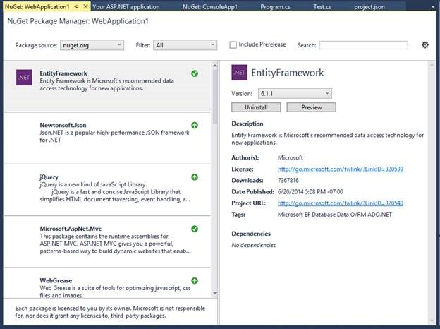

<properties
    pageTitle=".NET Framework 4.6"
    description="The latest version of the .NET Framework includes a host of features including WPF improvements, more Windows Forms High DPI controls, the next-generation JIT compiler, CLR performance improvements, DateTime to Unix time support, garbage collector updates, cryptography updates, and compatibility switches."
    slug="windowsnetfx"
    order="400"    
    keywords="visual studio, vs2015, vs, visualstudio, windows, windows 10, .NET framework"
/>

The latest version of the .NET Framework includes a host of features including WPF improvements, more Windows Forms High DPI controls, the next-generation JIT compiler, CLR performance improvements, DateTime to Unix time support, garbage collector updates, cryptography updates, and compatibility switches. Entity Framework 7 (beta 4) introduces additional new features and can run on .NET Framework 4.6 and .NET Core.

## WPF Improvements 

Improvements made to the WPF platform in the .NET Framework 4.6 and Visual Studio 2015 include the following:
 
- Transparent child windows
- Multi-image cursor files
- [Re-designed Blend experience](../../windows/blend)
- [New set of Visual Diagnostics tools](../../productivity/debugdiag/)
- [Timeline tool in the Performance and Diagnostics hub](../../productivity/debugdiag/)

## Windows Forms High DPI

The .NET Framework 4.5.2 included Windows Forms high DPI support for an initial set of controls. The .NET Framework 4.6 add support for more controls: DataGridView, ComboBox, ToolStripComboBox, ToolStripMenuItem, Cursor, DomainUpDown, NumericUpDown, DataGridViewComboBoxColumn, DataGridViewColumn and ToolStripSplitButton types.

This is an opt-in feature. To enable it, set the EnableWindowsFormsHighDpiAutoResizing element to true in the application configuration (app.config) file:

	<appSettings>
	   <add key="EnableWindowsFormsHighDpiAutoResizing" value="true" />
	</appSettings>

## Next Generation JIT Compiler -- RyuJIT

RyuJIT is the next generation 64-bit Just-In-Time (JIT) compiler for .NET, included with .NET Framework 4.6. It uses a high-performance JIT architecture, focused on high throughput JIT compilation. It is much faster than the existing JIT64 64-bit JIT that has been used for the last 10 years (introduced in .NET 2.0 release).

The project was initially targeted to improve high-scale 64-bit cloud workloads, although it has much broader applicabilty. We also do expect to add 32-bit support in a later release.

RyuJIT is on by default for 64-bit processes running on top of the .NET Framework 4.6. Your app will run in a 64-bit process if it is compiled as 64-bit or AnyCPU, and run on a 64-bit operating system. RyuJIT is similarly integrated into .NET Core, as the 64-bit JIT.

Some other changes include:

- **Correctness:** We've fixed many correctness bugs, using various Microsoft cloud workloads to validate RyuJIT. This approach has been working well, because the Microsoft cloud is a very heavy user of .NET.
- **Real-World Throughput:** The Bing team recently started using RyuJIT on some of their search-related workloads. Based on their initial experiments, they have seen a 25% improvement in startup time, which is a significant win.
- **SIMD Improvements:** We created the SIMD .NET library in unison with RyuJIT so that RyuJIT could optimize the SIMD types. Lately, we’ve been tuning our use of registers in the RyuJIT SIMD optimizations. CPUs can crunch numbers much faster in registers, since they are effectively memory on the CPU.

Although we have tried to make the transition to the new JIT compiler as transparent as possible, we also understand that there may be compatibility issues. If your application produces an undesired behavior on RyuJIT, you can try disabling RyuJIT, which switches your application back to using the previous JIT to determine if the problems you are seeing are caused by RyuJIT. 

## CLR Performance Improvements

The assembly loader uses memory more efficiency by unloading IL assemblies after a corresponding NGEN image is loaded. This change is a major benefit for virtual memory for large 32-bit apps (such as Visual Studio) and also saves physical memory.

## Garbage collector updates

The Garbage Collector has a new mode that attempts to avoid garbage collection while certain memory-related conditions are met. This new mode is important for workloads that require uninterupted computation (at least as it relates to GC CPU use).

The new mode enables you to specify a certain amount of memory be available as a pre-requisite to enter a No GC Region. While in the region the GC will not collect. It will start collecting if a collection is explicitly requested (e.g. GC.Collect) or if the initially specified memory size is exhausted.

The new mode exposes multiple points of configuration, including allowing you to specify the memory available for the small and large object heaps separately, for use within the No GC Region.

## Support for converting DateTime to or from Unix time

New methods have been added to support converting DateTime to or from Unix time. This can be necessary, for example, when converting time values between a JavaScript client and .NET server. The following APIs have been added to DateTimeOffset.

- static DateTimeOffset FromUnixTimeSeconds(long seconds)
- static DateTimeOffset FromUnixTimeMilliseconds(long milliseconds)
- long ToUnixTimeSeconds()
- long ToUnixTimeMilliseconds()

## Cryptography Updates

To date, the .NET Framework has use an earlier version of Windows Cryptography APIs as the basis of the System.Security.Cryptography implementation. In the .NET Framework 4.6, System.Security.Cryptography APIs support the Windows CNG cryptography APIs, which provides modern cryptography algorithms that are important for certain categories of apps. In this release, the team has specifically added support to use CNG certificate keys with the X509Certificate class.

## Channel support for managed EventSource instrumentation

You now can use .NET EventSource instrumentation to log significant administrative or operational messages to the event log, in addition to any existing ETW sessions created on the machine.

## Compatibility Switches

AppContext is a new compatibility feature that enables library writers to provide a uniform opt-out mechanism for new functionality for their users. It established a loosley-coupled contract between components in order to communicate an opt-out request. This capability is typically important when a change is made to existing functionality. Conversely, there is already an implicit opt-in for new functionality.

With AppContext, libraries define and expose compatibility switches, while code that depends on them can set those switches, to affect the library behavior. By default libraries provide the new functionality and only alter it (e.g. provide the old behavior) if the switch is set.

An application (or a library) can declare the value (always Boolean) of a switch that a dependent library defines. The switch is always implicitly false. Setting the switch to true enables the switch. Explicitly setting the switch to false provides the new behavior.

	AppContext.SetSwitch("Switch.AmazingLib.ThrowOnException”, true); 

The library must check if a consumer has declared the value of the switch and then appropriately act on it.

	bool shouldThrow;
	
	if (!AppContext.TryGetSwitch(“Switch.AmazingLib.ThrowOnException”, out shouldThrow))
	{
	    // The switch value was not set by the application. 
	    // As a result, the value is 'false'. A false value implies the latest behavior.
	
	    // The library can declare a default value for a switch based on a condition
	    // Example: https://github.com/dotnet/coreclr/blob/master/src/mscorlib/src/System/AppContext/AppContextDefaultValues.Defaults.cs
	}
	
	// The library can use the value of shouldThrow to throw exceptions or not.
	if (shouldThrow)
	{
	    // old code
	}
	else
	{
	    //new code
	}

It's beneficial to use a consistent format for switches, since they are a formal contract exposed by libraries. The following are two obvious formats.

- Switch.namespace.switchname
- Switch.library.switchname

This same infrastructure is used by the .NET Framework internally, to enable developers to opt out of updates to existing functionality.

## Nuget Package Manager

The Nuget Package Manager has been rewritten using the tool window style and can be viewed per project and solution. Each project can open a NuGet Package Manager window at the same time. This change applies to all type of projects that uses Nuget Package Manager. It’s also a lot nicer to look at.

