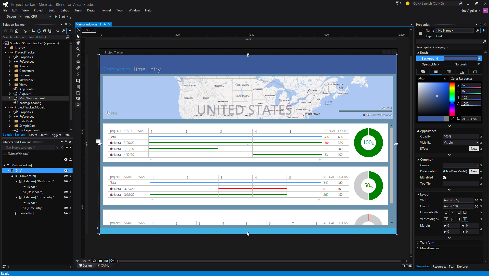
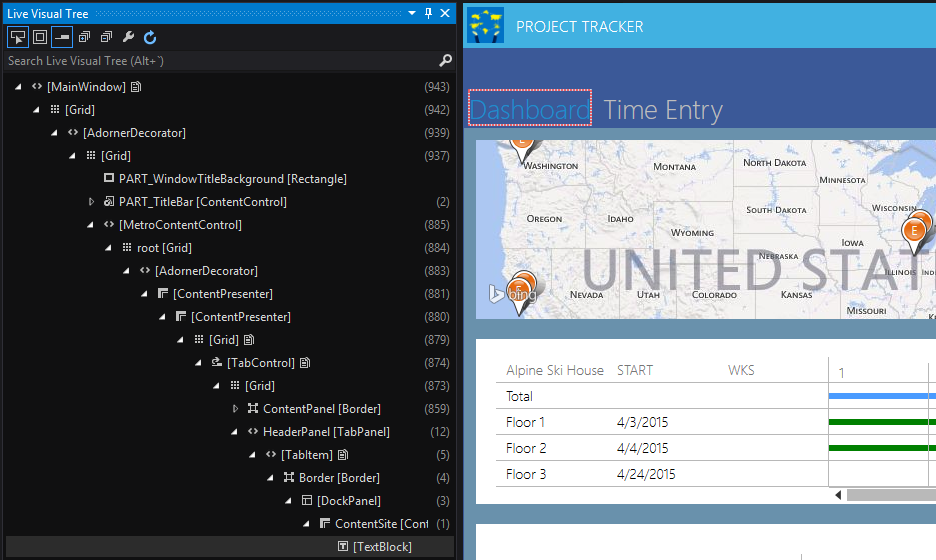

<properties
    pageTitle="Blend"
    description="Blend has been redesigned in Visual Studio 2015, making it the preferred tool for creating beautiful user interfaces with XAML. A new look that matches Visual Studio improves the workflow between the two products."
    slug="windowsblend"
    order="200"    
    keywords="visual studio, vs2015, vs, visualstudio, windows, windows 10, blend"
/>

More than ever, Blend is the preferred tool for creating beautiful user interfaces for XAML apps. Blend has many new features, including:

- A sleek new look resembling Visual Studio that improves the workflow between the two products
- A new Blend-exclusive Dark theme that improve the contrast between your content and the Blend user interface
- Basic debugging capabilities 
- Peek in XAML, which allows you to view and edit XAML controls and resources within the context in which they are used
- An improved file reload experience to minimize workflow interruptions as you work on your projects in both Blend and Visual Studio
- Custom window layouts that can be synchronized across machines that have Blend installed
- Better Solution Explorer and source control support
- Support for NuGet

## User interface tailored for XAML design

Blend's new user interface makes it easier to design your XAML apps by giving more space to the panes you use the most, including the properties and objects and timeline panes. In doing so, Blend provides you with a more pleasant and productive XAML design experience.

## Roslyn powered XAML IntelliSense

A new XAML language service provides you with faster and better XAML IntelliSense. The new XAML language service works in both Visual Studio and Blend.

## UI tools for XAML debugging

Blend includes tools for inspecting XAML at runtime. These tools enable you to inspect the visual tree of your running app and the properties of any element in the tree to make it easier to debug your XAML. To learn more, see see the [Debugging & Diagnostics page](../../productivity/debugdiag/) topic.

## Design in Blend, Edit in Visual Studio

To continue supporting the simultaneous XAML design and code editing experience between Blend and VS, both include the "Design in Blend" and "Edit in Visual Studio" commands on context menus in the solution explorer pane.

## Accessibility

As part of Microsoft’s ongoing effort towards creating accessible software, the Blend designer panes are themselves fully keyboard and screen reader accessible. Furthermore, we are actively working towards also making Blend high-contrast accessible.

