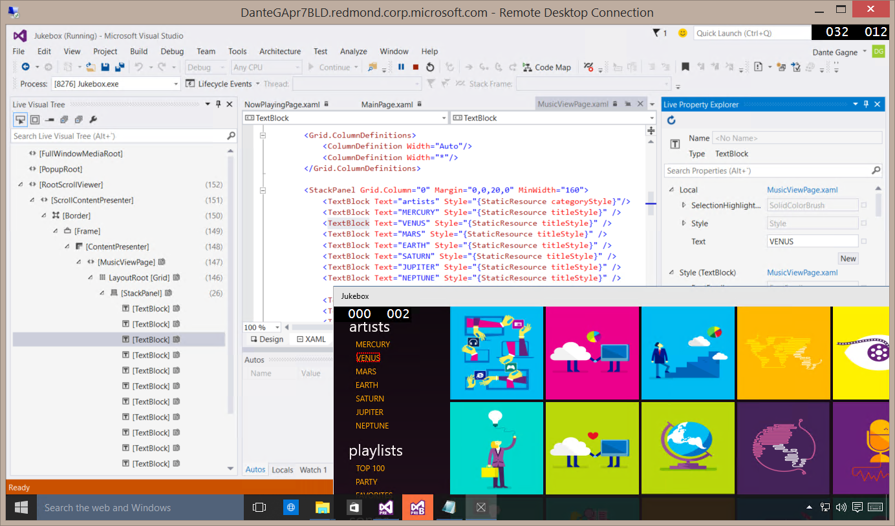

<properties
    pageTitle="Building for Windows"
    description="Windows 10 and the Universal Windows Platform brings new opportunities for developers across the full range of devices running Windows—from PCs to tablets, phones, HoloLens, Surface Hub, and soon Xbox and Raspberry Pi."
    slug="windows"
    order="400"    
    keywords="visual studio, vs2015, vs, visualstudio, windows, windows 10, universal windows apps, universal windows platform"
/>

Visual Studio 2015 continues to deliver the best tools for Windows. Visual Studio 2015 also delivers a redesigned XAML workflows in Blend, with IntelliSense, debugging, and NuGet, along with new capabilities for WPF applications on the Windows desktop, such as improved diagnostic tools.

