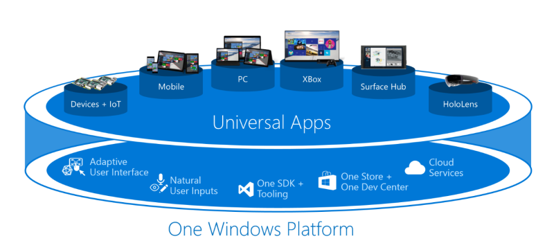

<properties
    pageTitle="Windows 10"
    description="With the Universal Windows Platform and our one Windows 10 core, you can run the same app on any Windows 10 device from phones to desktops. Create these Universal Windows apps with Visual Studio 2015 and the Universal Windows App Development tools."
    slug="windows10"
    order="100"    
    keywords="visual studio, vs2015, vs, visualstudio, windows, windows 10, universal windows apps, universal windows platform"
/>

Run your app on a Windows 10 phone, a Windows 10 desktop, or an Xbox: it's the same app package. With the introduction of the Windows 10 single, unified core, one app package can run across all platforms. Several platforms have Extension SDKs that you can add to your app to take advantage of platform specific behaviors. For example, an extension SDK for mobile handles the camera button being pressed on a Windows phone. If you reference an Extension SDK in your project, then just add runtime checks to test if that SDK is available on that platform. That's how you can have the same app package for each platform.

Key features include:

- Your choice of powerful languages and UI frameworks. You can use Visual Studio 2015 to build in C#, Visual Basic, C++, or JavaScript (including Cordova) and construct UI in XAML, DirectX, or HTML.
- Easily test and diagnose. Device previews allow you to preview your UX on different devices. Emulators and powerful visual diagnostic tools let you test it at run time.
- .NET Native makes apps run faster, with up to a 60% increase in startup time.
- Find out how well your app is doing in the real world. Application Insights gives you real time feedback on what your users are doing with your app. Visual Studio also offers [single-checkbox instrumentation for Application Insights](../../devopsalm/appinsights/).

## Reach Android, iOS, and Windows users with Apache Cordova

If you feel at home with HTML, CSS, and JavaScript, Visual Studio 2015 makes it easy for you to create native apps for Windows 10 as well as for Android and iOS using a shared codebase.

All of this is made possible because of Microsoft's collaboration with and investment in Apache Cordova. Not only will you be able to access native device APIs (e.g. camera, calendar, contacts, barcode scanner, and more), but because your apps take advantage of native webviews you can take your favorite JavaScript framework with you, like Angular, React, Ionic, and WinJS.

For more details, see [Visual Studio Tools for Apache Cordova](https://www.visualstudio.com/en-us/features/cordova-vs.aspx).

## Create Adaptive UX with the XAML Designer

Windows 10 provides the ability to use a single UI that can adapt from small to large screens to reach the maximum range of devices with your app, with the best possible user experience. This means that you no longer require separate projects or UI definitions for small and large screens, although you can still do that if you want to.

In the example below a different layout is used for the desktop and the phone app.

There's a new device toolbar above the designer for you to preview your layout on a range of devices.

## Tailor your app for a particular device

New extension SDKs allow you to adapt your code at runtime to deliver user experiences that feel right on the device your app is running on.

You can choose to tailor your app to light up additional device-specific capabilities using adaptive code patterns. You can reference an Extension SDK that supplies device specific APIs. Then you can write code that checks at runtime for the presence of the API so that your code can run on any device without crashing.

If you use the Windows Mobile Extensions for the UWP SDK, wrap calls to this API in an if block that checks for the presence of the API. That way the code execution is bypassed when the app is running on any Windows 10 device that does not support the API.

    if (Windows.Foundation.Metadata.ApiInformation.IsTypePresent("Windows.Phone.UI.Input.HardwareButtons"))
    {
        Windows.Phone.UI.Input.HardwareButtons.CameraPressed +=
            HardwareButtons_CameraPressed;
    }

## Test your Universal Windows apps

You can deploy a Universal Windows app to any physical device running Windows 10. You can also use the emulators to run your app on a device that you might not have available.

## Targeting versions of Universal Windows

Going forward we will be adding new capabilities to the Universal Windows Platform. You can set the minimum version of the platform that your app supports. You can also choose which version to use when you build your app using the target version.

## Debugging support

All of the capabilities of Visual Studio 2015 are available for Universal Windows apps including the new diagnostic tools, XAML UI debugging, and all of the profiling tools.  Together, these tools make debugging and diagnosing your Windows apps easier than ever.

For details, see the [Debugging & Diagnostics page](../../productivity/debugdiag/) topic.

## .NET Native for Windows 10 Apps

Universal Windows appls written in C# or VB can be optimized using .NET Native, which is automatically applied for "Release" builds. Apps built with .NET Native tools get up to a 60% improvement in startup time, depending on the app, and up to 20% improvements in overall memory consumption compared to Windows 8.1 .NET applications.

.NET apps in Windows 10 now use the optimized, converged, and open-source [.NET Core](http://blogs.msdn.com/b/dotnet/archive/2014/12/04/introducing-net-core.aspx). This framework unifies .NET libraries across client and server scenarios. "Debug" builds of your Windows 10 apps will run on the open-source CoreCLR using the .NET Core libraries. Running on CoreCLR allows for rapid F5 cycle times during development, and .NET Native provides performance improvements once you're ready to ship.

## Use Extension SDKs and 3rd party libraries

To do more with your Universal Windows apps, you can reference additional Extension SDKs and other 3rd party libraries. These Extension SDKs can also be released separately for the Universal Windows Platform. For example, there will be new Extension SDKs as more device families are released. The Nuget manager in Visual Studio 2015 provides access to a wide range of 3rd party libraries. For example, use a 3rd party library to get better support for JSON.

## Windows Desktop applications

All of your Windows Desktop apps (WPF, Windows Forms, and Win32) continue to work on Windows 10 without any changes. The Universal Windows Platform bridge for classic windows apps will enable developers to call UWP APIs from win32 code. Windows 10 also comes pre-installed with .NET Framework 4.6 which includes many new features including improvements in WPF and Windows Forms.
