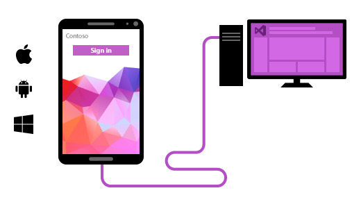
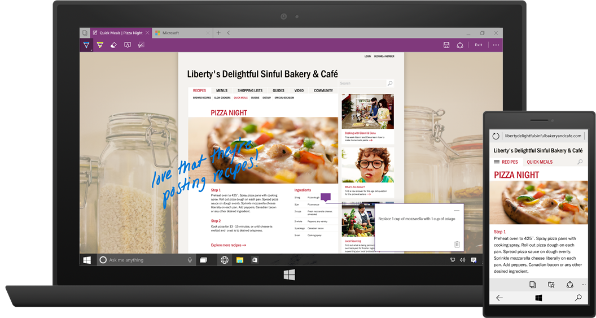
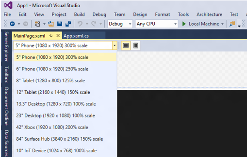
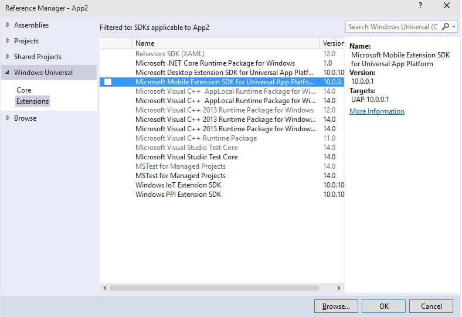
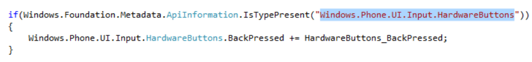

<properties
    pageTitle="Windows 10"
    description="Windows 10 and the Universal Windows Platform brings new opportunities for developers across the full range of devices running Windows—from PCs to tablets, phones, HoloLens, Surface Hub, and soon Xbox and Raspberry Pi."
    slug="windows10"
    order="100"    
    keywords="visual studio, vs2015, vs, visualstudio, windows, windows 10, universal windows apps, universal windows platform"
/>

True to its origins, Visual Studio 2015 remains the premier development environment for the latest platform release, Windows 10, and the Universal Windows Platform. These tools, which are integrated with Visual Studio setup, enable you to build Windows apps that run across all Windows devices, from Windows Phone to Xbox and Windows Store. In addition, you can also use these tools to build Windows Desktop Applications that leverage Windows 10 APIs. 

Key features include:

- Your choice of powerful languages and UI frameworks. You can use Visual Studio 2015 to build in C#, Visual Basic, C++, or JavaScript (including Cordova) and construct UI in XAML, DirectX, or HTML. Project templates are listed under "Windows Universal."
- Quickly build an app to run everywhere. Visual Studio 2015 provides a template for your app to run on every Windows 10 device. You can tailor your experience for any device using built-in platform capabilities.
- Easily test and diagnose. Device previews allow you to preview your UX adapting in the designer. Emulators and powerful visual diagnostic tools let you test it at run time.
- .NET Native makes apps run faster, with up to a 60% increase in startup time.
- The Timeline tool for Windows and WPF apps provides a scenario-centric view of resources that an app consumes. See the [Debugging & Diagnostics page](../../productivity/debugdiag/) topic. 
- Find out how well your app is doing in the real world. Application Insights gives you real time feedback on what your users are doing with your app. Visual Studio also offers [single-checkbox instrumentation for Application Insights](../../devopsalm/appinsights/).

## Reach Android, iOS, and Windows Users with Apache Cordova

If you feel at home with HTML, CSS, and JavaScript, Visual Studio 2015 makes it easy for you to create native apps for Windows 10 as well as for Android and iOS using a shared codebase.

All of this is made possible with our collaboration with and investment in Apache Cordova. Not only will you be able to access native device APIs (e.g. camera, calendar, contacts, barcode scanner, and more) through JavaScript, because your apps take advantage of native webviews, you can take your favorite JavaScript framework with you, like Angular, React, Ionic, and WinJS.

For more details on the Visual Studio Tools for Apache Cordova, see, TODO

## Creating Adaptive UX in the XAML Designer

Windows 10 provides the ability to use a single UI that can adapt from small to large screens to reach the maximum range of devices with your app, with the best possible user experience. This means that your universal app projects no longer require separate projects or UI definitions for small and large screens, although we will still provide the option of separate UI definitions should you prefer it.

In the example below a different layout is used for the desktop and the phone app.

You can then use the new device toolbar above the designer to preview your layout on a range of devices.

## Tailoring your app for a particular device

New Windows 10 API contracts and the extension SDKs allow you to adapt your code at runtime to deliver user experiences that feel right on the device it’s being run on.

You can choose to tailor your app to light up additional device-specific capabilities using adaptive code patterns. You can reference an Extension SDK that supplies device specific APIs and write code that checks for the presence of the API when running on any device before code execution.

In the example above, we have added a reference to a Mobile extension SDK. Wrapping the access to such an API in an if block allows for the code execution to be bypassed when the app is running on any Windows 10 device that does not support the API.

## Testing your Universal Windows apps on a PC and phone

You can deploy a Universal Windows app to any device running Windows 10. You can pick which device to test your app on from the emulator dropdown.

## Targeting versions of Universal Windows

Going forward we will be adding new capabilities to the Windows 10 developer tools. You can set which the minimum version of the platform you can install your app on. You can also specify which version you build against on your machine using target version.

## Debugging support

All of the capabilities of Visual Studio 2015 are available for Universal Windows apps including the new diagnostic tools, XAML UI debugging, and all of the profiling tools.  Together, these tools make debugging and diagnosing your Windows apps easier than ever.

For details, see the [Debugging & Diagnostics page](../../productivity/debugdiag/) topic.

## .NET Native for Windows 10 Apps

Universal Windows applications written in C# or VB can be optimized using .NET Native, which is automatically applied for "Release" builds. Apps built with .NET Native tools enjoy up to a 60% improvement in startup time, depending on the app, and up to 20% improvements in overall memory consumption over Windows 8.1 .NET applications.

.NET apps in Windows 10 now use the optimized, converged, and open-source [.NET Core](http://blogs.msdn.com/b/dotnet/archive/2014/12/04/introducing-net-core.aspx). This framework unifies .NET libraries across client and server scenarios. "Debug" builds of your Windows 10 apps will run on the open-source CoreCLR using the .NET Core libraries. Running on CoreCLR allows for rapid F5 cycle times during development, and .NET Native provides performance improvements once you're ready to ship.

## Consuming Extension SDKs and 3rd party libraries

To do more with your Universal Windows application, you can reference additional Extension SDKs and other 3rd party libraries. These SDKs can also be released separately for the Universal Windows platform – for instance as more device families are released. The Nuget manager in Visual Studio 2015 provides access to a wide range of 3rd party libraries, for example support for Json.

## Windows Desktop applications

All of your Windows Desktop applications (WPF, Windows Forms, and Win32) continue to work on Windows 10 without any changes. The Universal Windows platform bridge for classic windows apps will enable developers to call UWP APIs from win32 code. Windows 10 also comes pre-installed with .NET Framework 4.6 which includes many new features including improvements in WPF and Windows Forms.
