<properties
    pageTitle="Android Emulator"
    description="The Visual Studio Emulator for Android is based on Hyper-V, and is targetable by any Android project with configurable images such as Lollipop and KitKat."
    slug="androidemulator"
    order="400"    
    keywords="visual studio, vs2015, vs, visualstudio, cross-platform, mobile apps, iOS, Android, Windows Phone, Android emulator"
/>

# The Visual Studio Emulator for Android

## Summary

The *Visual Studio Emulator for Android* emulates physical devices such as phones or tablets on your computer, letting you test your apps against a wide variety of virtual devices. Except for making phone calls, the Emulator simulates all of the features of an actual physical device, including accelerometer, screen rotation, GPS Location, camera, power and battery level, network access, WiFi, and OpenGL. It simulates keyboard input, multi-touch, drag-and-drop, and zoom.

You can use the Emulator in Visual Studio *Xamarin* or *C++* cross-platform projects, or in *Visual Studio Tools for Apache Cordova*. The Emulator lets you switch between different virtual devices without Hyper-V conflicts. It supports Android versions 4.2 (JellyBean, API Level 17), 4.4 (KitKat, API Level 19), 5.0 (Lollipop, API Level 21), and 5.1 (Lollipop, API Level 22).

## Choosing a virtual device

Testing your Android app for compatibility across the staggering variety of Android hardware can be a challenge. Android phones and tablets in the market span a wide range of versions and screen sizes and come in many different hardware configurations (RAM, CPU architecture, number of cores, and so on). Making sure that your app works as expected for the most popular devices on the market can be difficult. 

The *Visual Studio Emulator for Android* addresses this problem by introducing **Device Profiles**. A curated set of device profiles represents the most popular hardware in the market, including devices from Samsung, Motorola, Sony, LG, and others, and is pre-installed. A wider selection is available by using the **Emulator Manager** to install and run additional device profiles.

### Pre-installed device profiles

You can simply choose a pre-installed profile, if it meets your testing needs. Here's how the device profile drop-downs appear.

For Cordova: 

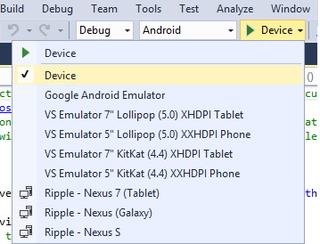

For Xamarin: 

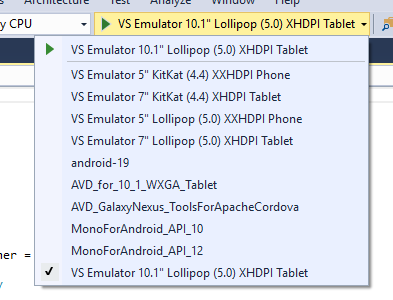

And for C++ projects:

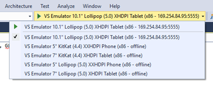

### Installing Device Profiles with Emulator Manager

If none of the pre-installed profiles meets your requirements, you can install additional profiles. In Visual Studio 2015, use the **Tools** > **Visual Studio Emulator for Android** menu to start the **Emulator Manager** (or access the manager from the Start menu).

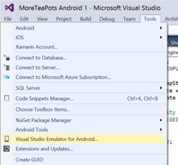

You use the **Emulator Manager** to install, uninstall, and start device profiles. By default, two device profiles (KitKat phone/5" and tablet/7" configurations) are installed, as indicated by the white text and icons. Other profiles in the list appear grayed out until you click the **Install Profile** button and the installation completes. You can filter the list by API Level (currently 19 and 21) and click the details arrow on the bottom right-hand side of a profile to view its full configuration details.

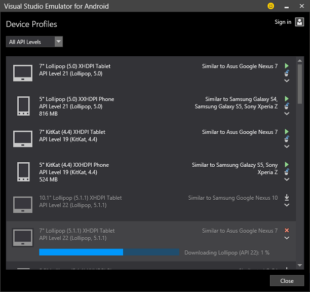

Once you've installed the set of profiles that you'd like to target, you can start these new profiles directly from the manager by pressing the green **Play** button.

## Debugging with the Emulator

### Installing your app

Compiling an Android app creates an *application package file*, known as an APK, which you install onto a virtual device for testing. The Emulator can also load other files onto a simulated SD card. Once you have chosen (and if necessary, installed) a virtual device, press F5 and your app will be compiled and deployed to the emulator. 

The emulator fully supports Visual Studio debugging. You can set breakpoints in your code, view the call stack, inspect variables, and so on.

#### Install APKs through drag and drop

 You can also install an APK on the Visual Studio Emulator for Android by dragging it onto the emulator from Windows Explorer. You will see a message in the emulator indicating progress “Installing 'foo'” followed by a message box “APK **'foo'** installed successfully”. Remember to make sure your APKs have code built for x86!

#### SD Card

You can drag and drop non-APK files onto the emulator and they will be put on the virtual device's SD Card. If your app needs to read or write to the SD card, the emulator simulates that by making available a folder representing the card.

## Emulator Capabilities

Many emulator features are accessed from the vertical toolbar, by clicking on the **Tools** button to show the **Additional Tools** fly out panel, where there are tabs available for **Accelerometer**, **Location**, **Battery**, and **Network**.

### Accelerometer

If your app tracks and responds to movement of the device, you can test movement using the **Accelerometer** tab when you open the **Additional Tools**.

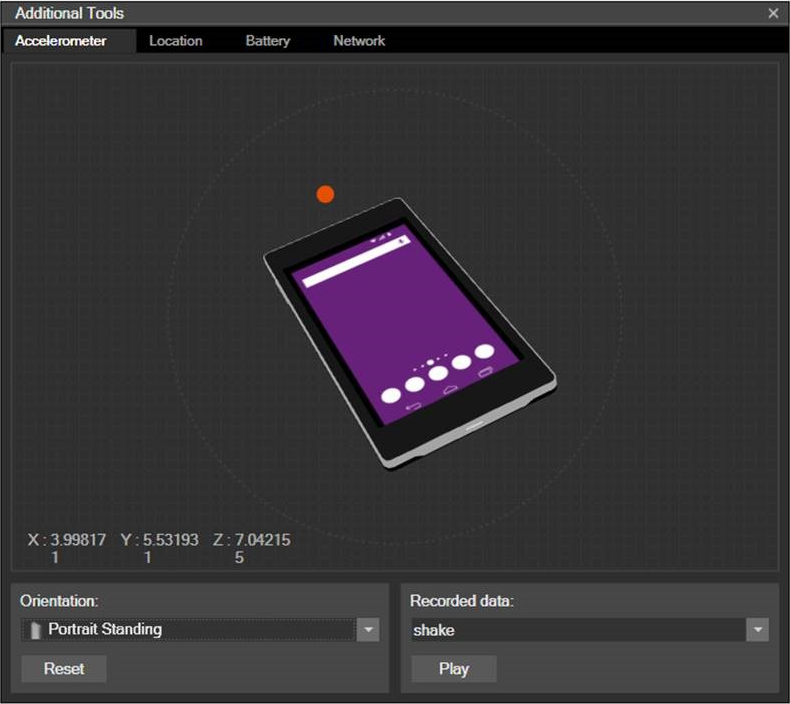

Simply click and hold the red dot in the middle and drag it towards the directions you want to simulate, within the 3D plane. As you do that your app will receive movement events if it has registered for them.

You can also see the X, Y, Z values in the bottom left. Under those values you can **Reset** to the starting position, and also pick the starting **Orientation** from these values: *Portrait Standing*, *Landscape Standing*, *Portrait Flat*, and *Landscape Flat*.

You can simulate shaking the phone by clicking the **Play** button in the bottom right. The only visual indication that a shake is taking place are the values of the X, Y, and Z coordinates. When they stop changing rapidly, you’ll know the shake is over.

### Orientation / Rotation

Unless your app only supports a fixed orientation, you should test how your app responds to orientation changes, and what it looks like in portrait, left-landscape, and right-landscape orientations. Simply rotate the emulator left or right with the two corresponding buttons on the vertical toolbar: **Rotate Left** and **Rotate Right**. The size of the emulator remains the same when you rotate.

### Location (GPS)

If your app does anything with navigation, geofencing, walking, biking, or driving, you can use the location and driving simulation tools in the emulator to create repeatable, realistic tests. The location tools are found under the **Location** tab in **Additional Tools**.

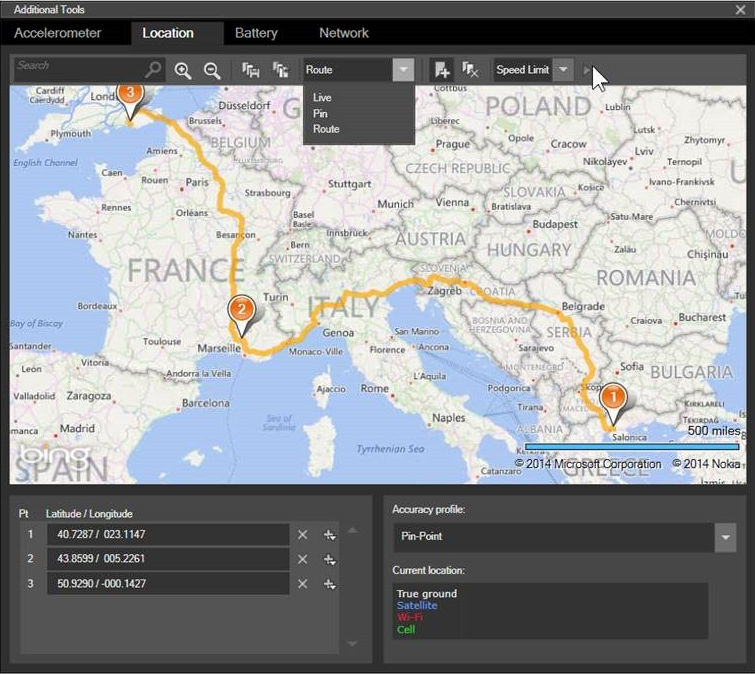

You can navigate the map by dragging it around, by zooming in and out, or even by searching for a location. You can place and remove pins on the map, creating **map points**. These appear as latitude-longitude coordinates in the list in the bottom left. From the toolbar at the top you can even save those map points to an XML file and later load them from the file.

Instead of having each map point immediately change the GPS location of the emulator (**Live mode**), you have other options. You can place a few map points and then simulate transitioning between those points. To do that, in the toolbar at the top switch from **Live mode** to **Pin mode**. Then press the small **Play** button at the end of the toolbar to transition between the map points. You can even enter a transition interval (in seconds).

Finally, you can choose **Route mode**, which is similar to **Pin**. In Route mode you can set additional options for the simulated transitions between points. The simulator calculates an actual path between the points and generates invisible points at 1 second intervals between the points you choose. The playback speed can be set to *Walking* (5 kilometers per hour), *Biking* (25 km/h), *Speed Limit* (variable dependent on map point), and *Fast*.

### Camera

If your app uses the camera (by using an appropriate API), the emulator supports that. You can use the built-in camera app directly. When you launch the camera in the emulator you will see a fixed animated image that you can take a snapshot of, simulating taking a picture. You can also navigate to the **Camera** tab in **Additional Tools**, where you can switch the input for Front and Rear Camera to display a default animation, a picture from file, or an attached web-cam. Any web-cam recognized by Windows shows as an option in the drop down lists for front and rear cameras.

### Power/Battery Simulation (and Power button)

If you write your app to respond to battery charge changes, you can simulate them by switching to the **Battery** tab when you open the **Additional Tools**.

A slider allows you to set the exact charge value of the battery. The battery icon in the top right changes to reflect the new value. Your app also responds accordingly.

If you change the Battery Charging State to not be *Charging*, the emulator’s screen goes blank after a timeout period. You can configure the timeout though the built-in regular **Settings** app, by using the *Sleep* option under **Display**. If the emulator enters sleep mode, you can wake it up by using the **Power** button on the vertical toolbar.

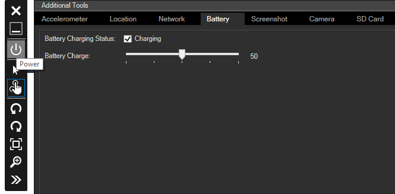

### Network Information

The emulator reuses the network connection of the host machine, so there is nothing for you to configure. You can review the emulator’s current network settings from the **Network** on **Additional Tools**.

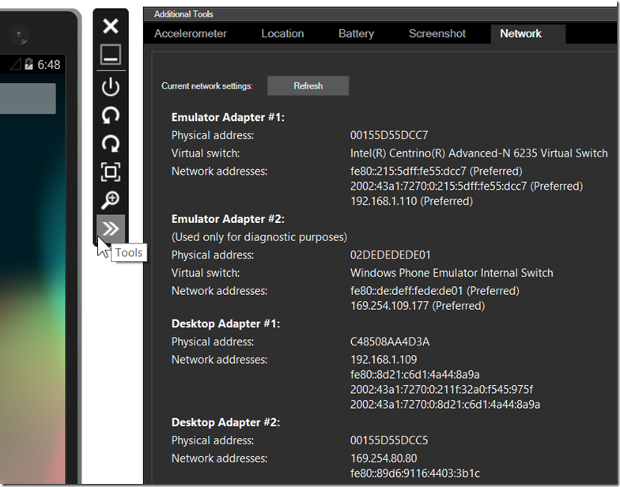

### WiFi Simulation

Apart from touch, the most commonly-used device feature in Android apps is WiFi. In addition to simulating a network connection over Ethernet, the emulator also simulates the more common scenario of a connection to a WiFi network.

### Zoom

You can change the size of the emulator as you see it on your development machine (the host). The dots per inch (DPI) for the emulator is based on the host monitor DPI, regardless of the zoom value. This allows you to scale the emulator in case it is taking too much space on your desktop.

To change the size, use the **Zoom** button on the emulator's vertical toolbar.

You can also use the **Fit to Screen** button above the **Zoom** button to fit the emulator on your screen.

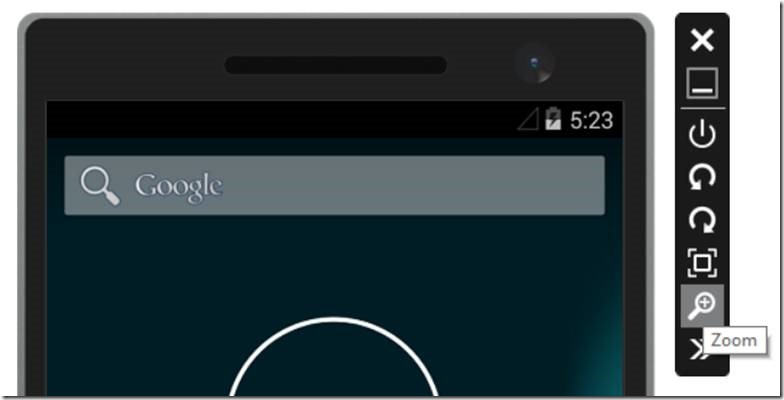

### Screenshots

To take a screenshot of your app, open the **Additional Tools** and switch to the **Screenshot** tab. Then click on the **Capture** button. This takes a screenshot and shows you an instant preview. To keep the screenshot, click on the **Save…** button. If you don’t like the screenshot you took, ignore it or click **Capture** again.

The **Screenshot** tab captures the image at the same screen resolution displayed on your monitor. For best results when you take screen-shots of your app, set the zoom level to the maximum of 100%.

### SD card

If your app needs to read or write to the SD card of the device, the Emulator simulates that by making available a folder representing an SD card. The Emulator uses a separate VHD for SD card support. So if you want to transfer files to/from the SD card on your development machine, you can mount the VHD to Windows. Once the VHD is mounted as an additional drive to Windows, you can use it like any other drive.

Support for the SD card in the Emulator also allows other built-in Android apps to function, such as the browser downloads and the camera app.

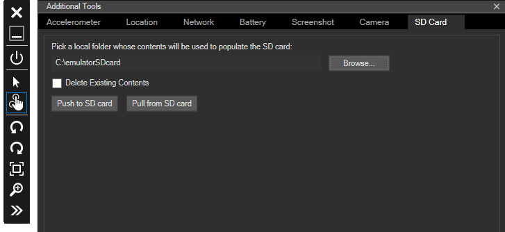

### Camera

The Emulator supports using the camera from your app (using an appropriate API), and it also supports using the built-in camera app directly. When you launch the camera in the Emulator, you will see a fixed animated image that you can take a snapshot of, simulating taking a picture. In the **Camera** tab, you can switch the input for front and rear camera to display a default animation, a picture from a file, or an attached webcam. Any webcam recognized by Windows will show up in the dropdown lists for front and rear cameras.

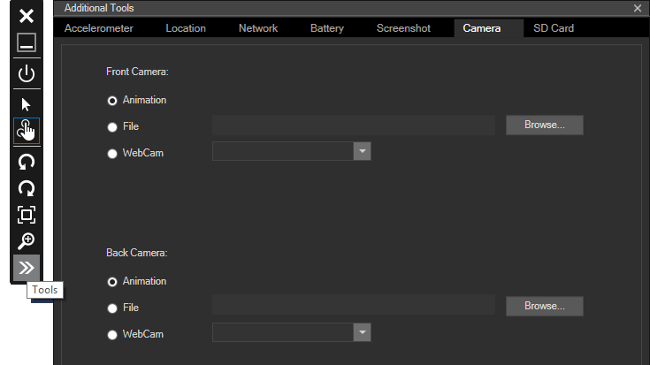

### Multi-touch

If your app makes use of more than one simultaneous touch point (for example, for pinch functionality), you can select between **Single Point Input** and **Multi-touch Input** on the vertical toolbar that appears next to the emulator display.

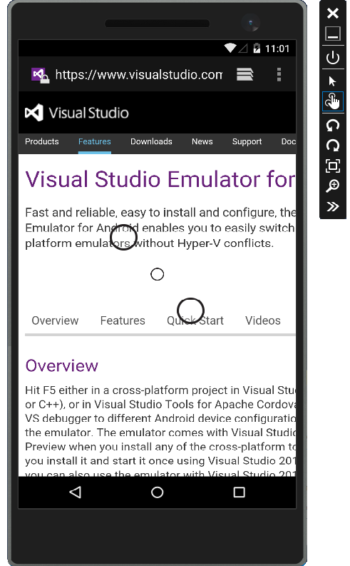

Selecting **Multi-touch Input** overlays three dots on the screen. The two large outer dots act as touch points for pinching and zooming, and the inner dot controls the origin for the touch points. If you're using the emulator on a touchscreen you can use your fingers to directly interact with the emulator screen.

### Audio Playback 

The audio output by the emulated device is played back through your computer's speakers. 

### Keyboard Text Input

When the emulator displays an on-screen keyboard, you can use your computer's keyboard to enter text directly. 

