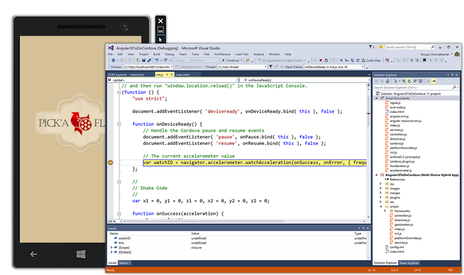
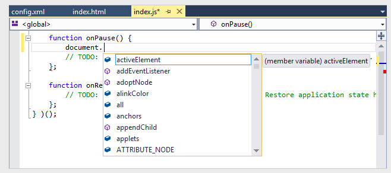
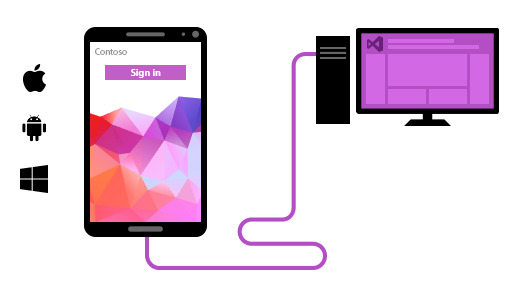
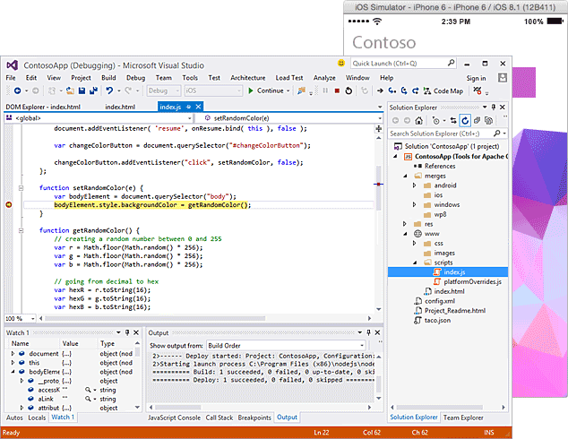
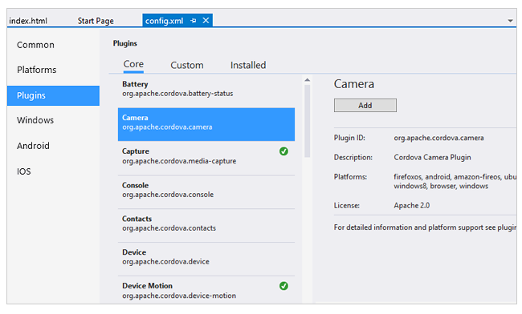
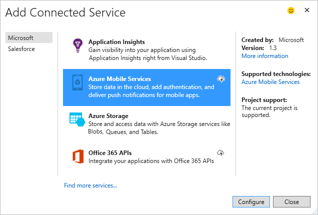

<properties
    pageTitle="Apache Cordova"
    description="Visual Studio Tools for Apache Cordova enables developers to use their HTML, CSS, and JavaScript (or TypeScript) skills to write and debug hybrid apps that require little or no platform-specific customizations."
    slug="cordova"
    order="100"    
    keywords="visual studio, vs2015, vs, visualstudio, cross-platform, mobile apps, iOS, Android, Windows Phone, JavaScript, Cordova, hybrid app"
/>

If you know how to build web apps, you’ll quickly feel at-home building mobile apps for iOS, Android and Windows using Apache Cordova. Most developers achieve nearly 100% code re-use by leveraging Cordova’s shared JavaScript API to access native device capabilities like the camera, calendar and contacts.

Plus, because hybrid apps make use of native webviews, you can take your favorite JavaScript framework with you – frameworks like Angular, React and Ionic.

## Installation of dependencies

To make it easy for developers to get started with Apache Cordova, Visual Studio 2015 automates the installation of the many Cordova dependencies, such as the Android SDK and the Java SDK. Building apps is fast, with nearly 100% of your code shared across all platforms. Cordova plugins, which are easily installed and managed within Visual Studio, provide access to a wide range of native platform capabilities.

Developers can use whatever JavaScript frameworks and libraries they choose and then take full advantage of Visual Studio's powerful code editors, which include IntelliSense, extensive debugging capabilities on all platforms, and the ability to test in emulators or on physical devices.

## JavaScript editing

As applications become more complex, you need more than just a text editor. You need a code editor optimized for refactoring, auto-completion and code comprehension. Visual Studio provides all that and more, including:

- Syntax highlighting to help you visually identify errors
- IntelliSense to help you better understand and code against new APIs
- Code peek for in-line reference review

For a full list of improvements to the JavaScript editor in Visual Studio 2015, see the JavaScript Editor and IntelliSense section of the [IDE Improvements](../..productivity/ide/) topic.

## Preview and test

Whether you’re targeting iOS, Android or Windows, Visual Studio provides preview support for a wide variety of emulators and tethered devices. You can even deploy and debug emulators hosted on a remote or virtual machine (e.g. Parallels).

For developers working in an exclusively Windows-based work environment, Visual Studio offers the ability to build for Mac OS remotely via services like MacInCloud.

## Debug and analyze

Anywhere your code runs, Visual Studio can debug it – whether your code is running on an iOS, Android or Windows device, an emulator or simulator, or a browser-based debug target like Ripple. There's no need to switch tools when you build for a different platform. Visual Studio connects to almost any deploy target.

Visual Studio’s debugger lets you step through code with breakpoints and automatic exception notifications that expose the run-time state of objects and variables. Advanced features like edit-and-continue, conditional breakpoints, tracepoints and hit counts provide the kind of deep analysis you need to make coding enjoyable and not a merciless game of “find the bug.”

## Access native device capabilities

Powered by Apache Cordova, your apps written in HTML, CSS, and JavaScript can easily access native device APIs not yet available to browsers (e.g. camera, calendar, contacts, barcode scanner, and more!).

Best of all, you can access native device capabilities through a common JavaScript API so you get maximum code re-use throughout your application.

## CLI interoperability.

Cordova projects in Visual Studio synchronize with changes made to your project folder on-disk. Changes can flow in and out of Visual Studio whether you’re working with third-party tools or on other operating systems. (The default file structure for Cordova projects is based on the structure expected by the Apache Cordova command-line tools, which makes it easier to work directly with the Apache Cordova CLI or other tools that expect that folder structure.)

## Connect to data

Visual Studio and Azure provide the tools and services necessary to deliver a personalized experience across all your devices – phones, tablets, desktops, TVs and “things” running iOS, Android and Windows.

With just a few lines of code, you can:

- Use push notifications to connect with specific users or entire audiences
- Enable real-time messaging to spark conversation and sharing among your users
- Support offline capabilities for those times when a network connection isn’t available
- Manage Exchange data using Office 365 Service APIs to share and edit calendars, contacts, files and more

Most importantly, you have the backing of Azure to scale to millions of devices on-demand.

[Learn more](https://www.visualstudio.com/en-us/features/cordova-vs) | Included with Visual Studio 2015

