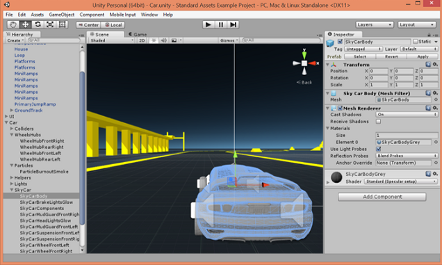
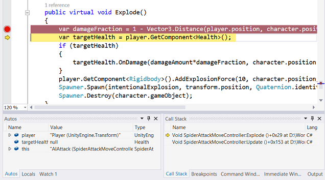
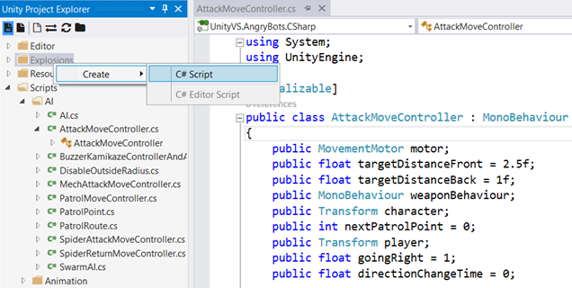
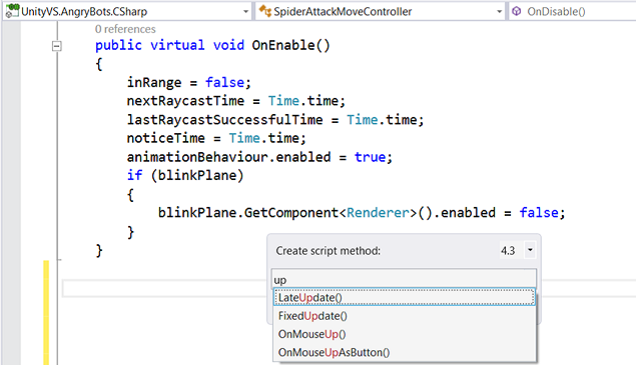
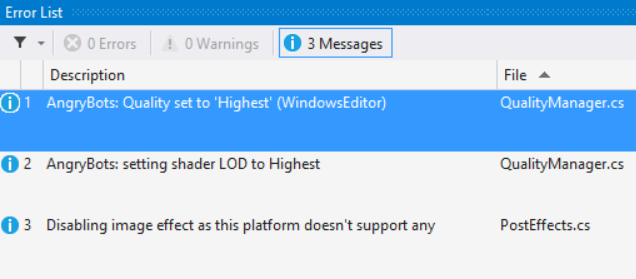

<properties
    pageTitle="Unity"
    description="With the downloadable Visual Studio Tools for Unity extension, game and high-performance graphics developers use C# for their Unity scripts in Visual Studio. Developers enjoy streamlined workflows and debugging in conjunction with Unity tools, which can target multiple mobile platforms from a single code base."
    slug="unity"
    order="500"    
    keywords="visual studio, vs2015, vs, visualstudio, cross-platform, mobile apps, iOS, Android, Windows Phone, Unity"
/>

 *Download this extension from [Visual Studio 2015 Tools for Unity](https://visualstudiogallery.msdn.microsoft.com/8d26236e-4a64-4d64-8486-7df95156aba9). Not included with Visual Studio 2015 setup.*

Unity is a game engine and development environment for creating cross-platform games. The Unity engine runs on over a dozen platforms spanning from powerful PCs, to game consoles, to touch-enabled tablets and mobile phones—even to the web. The Unity editor provides a friendly interface for building rich game worlds. The capability, ease-of-use, and reach of Unity make it a popular choice among today's game developers.

The Unity editor is great for putting your game world together, but you can't write your code in it. With Visual Studio Tools for Unity, you can use the familiar code editing and productivity features of Visual Studio to create editor and game scripts for your Unity game using C#, and you can debug them using Visual Studio's powerful debugging capabilities.

But Visual Studio Tools for Unity is more than that; it also has deep integration with Unity editor so that you'll spend less time switching back and forth to do simple tasks, provides Unity-specific productivity enhancements, and puts the Unity documentation at your fingertips. 

## Integration with Unity
 
Visual Studio Tools for Unity wouldn't be a productivity enhancer if you had to switch back and forth between the Unity editor and Visual Studio all the time. That's why Visual Studio Tools for Unity makes it easy to keep doing work without leaving Visual Studio.

- The Unity Project Explorer displays your entire Unity project inside Visual Studio using the same hierarchy displayed in the Unity editor. 
- Unity console integration displays output from the Unity console right inside Visual Studio's error window.
- Start debugging your game from Visual Studio – no need to switch back to Unity, just press F5.

## Superior Debugging
 
Connect Visual Studio's powerful debugger to your Unity game to debug your C# scripts and DLLs regardless of whether it's running standalone or in the Unity editor. You can use all the debugging features you expect from Visual Studio.

- Breakpoints, including conditional breakpoints.
- Evaluate complex expressions in the Watch window.
- Inspect and modify the value of variables and arguments.
- Drill down into complex objects and data structures.

You can even debug your Unity game while it runs on another machine on your network.

## Unity Project Explorer

The Unity Project Explorer in Visual Studio displays all of your Unity project files and directories in the same hierarchy that the Unity Editor does. Use the Unity Project Explorer to navigate and create your Unity scripts - no more switch back and forth between multiple IDEs. Open and edit the Unity scripts in the Visual Studio shader editor that enables syntax colorization for the Unity scripts.

## Productivity
 
In addition to Visual Studio's established productivity for writing and refactoring code in C#, Visual Studio Tools for Unity provides extra productivity features for Unity developers.

- Syntax coloring for the Unity's ShaderLab language helps you spot mistakes in your shaders before they become bugs. Just open your ShaderLab files in Visual Studio.
- The MonoBehavior wizard allows you to browse a list of Unity behaviors and creates boilerplate code for behaviors you might not be familiar with. Press CTRL+ALT+M.
- Once you're familiar with the Unity behaviors you use most, the Quick MonoBehavior wizard puts them right at your fingertips. Press CTRL+ALT+Q.
- Access Unity documentation from Visual Studio. Just highlight the API call you want to learn about, then press CTRL+ALT+M, CTRL+H.
- Access all these features and more with keyboard shortcuts.

## Integrated error list

Build your Unity projects inside Visual Studio and get an integrated error list in the Visual Studio Error List window. The error list includes results from the Unity console when Visual Studio is connected to a Unity instance. No more switching back and forth between multiple IDEs.

## Visual Studio Tools for Unity API
 
Customize and extend the behavior of Visual Studio Tools for Unity using the provided APIs.

- Visual Studio Tools for Unity registers a log callback so it can stream the Unity console to Visual Studio. If you have editor scripts that log information, you can plug them into the same callback to send your messages to Visual Studio.
- You can change how Visual Studio Tools for Unity generates project files by using the Unity style callback ProjectFileGeneration.

