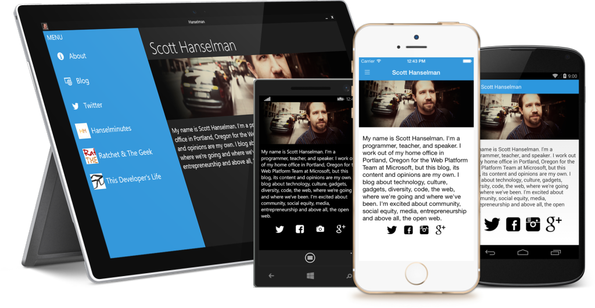
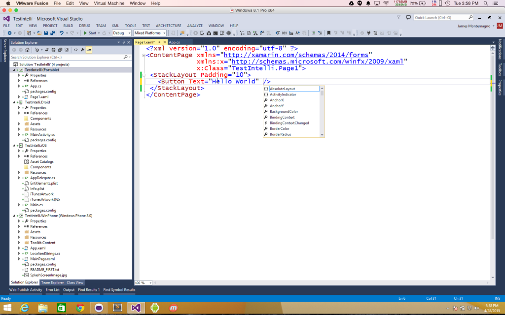
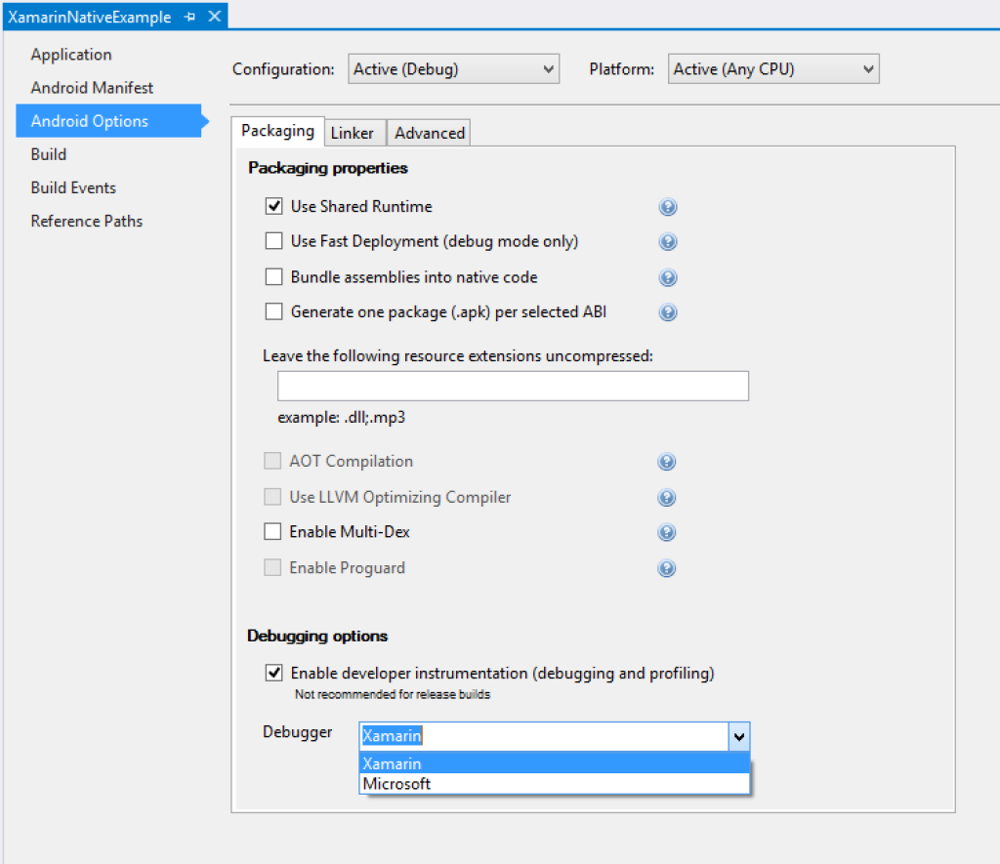
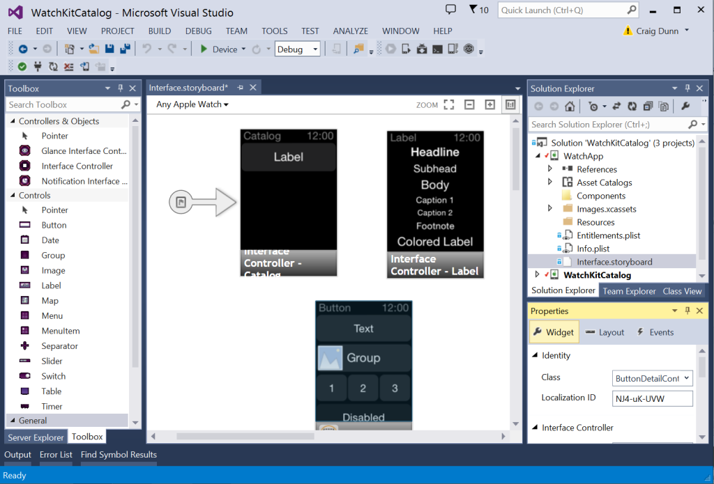

<properties
    pageTitle="Xamarin"
    description="Xamarin tools combined with Visual Studio empowers developers to write and debug fully native cross-platform mobile apps by using C# and .NET, with 75% to nearly 100% shared code across platforms."
    slug="xamarin"
    order="300"    
    keywords="visual studio, vs2015, vs, visualstudio, cross-platform, mobile apps, iOS, Android, Windows Phone, C#, Xamarin"
/>

With [Xamarin](https://www.xamarin.com), you'll get the benefits of using C# and .NET and also powerful Visual Studio IDE features like CodeLens and third-party extensions. With code written in C#, you can leverage a [wide range of application lifecycle management (ALM) tools](https://msdn.microsoft.com/en-us/library/mt162217(v=vs.140).aspx) in Visual Studio as well.

Visual Studio 2015 also includes the free Xamarin Starter Edition, making it easier for you to get started with Xamarin without the need to install it separately. 

Xamarin issues updates on a separate schedule from Visual Studio; keep up to date on http://blog.xamarin.com/. Here, though, we'll give some highlights that apply to working with Xamarin in Visual Studio 2015.  

## Xamarin.Forms for Windows

Xamarin.Forms support for the Windows platform has been updated to support Windows 8.1, and Windows Phone 8.1 apps. This means that you can build and ship Xamarin.Forms apps that target all of the major mobile platforms from a single code base. 

## Code Completion for Xamarin.Forms XAML

Declarative UI development in Visual Studio gets even more powerful with code completion for Xamarin.Forms. You can easily explore Xamarin.Forms user interface APIs, quickly build complex screens, and avoid typos and other common mistakes while creating UIs in XAML.

## Visual C++ Debugger Integration

You can reference and debug native C++ libraries in a Xamarin.Android app. Just choose the **Microsoft** debugger in the project's property pages. Then, you can step through those libraries by using all of the debug features you know and love, including expression evaluation, watch window, and auto window. 

## Enhanced WatchKit Support

You can edit Apple Watch storyboards by using the iOS designer in Visual Studio. Drag interface controllers and UI controls onto the storyboard from the Visual Studio **Toolbox**, configure properties on the **Properties** pad, and drag buttons, tables, or interface controllers onto other interface controllers to create segues.

## iOS Binding Projects

You can consume third party Objective-C libraries in your Xamarin.iOS project. Just add a Xamarin.iOS Binding project to your solution. There's plenty of guidance on the Xamarin website for how to do the rest.
