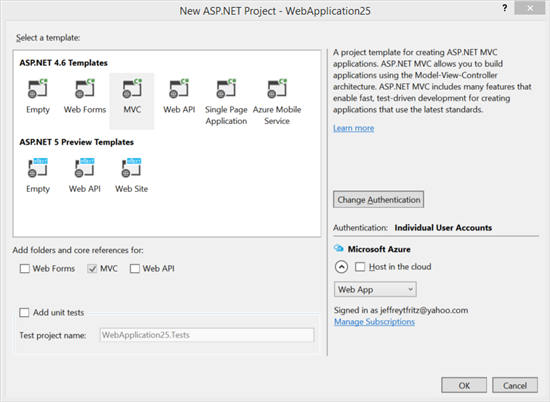
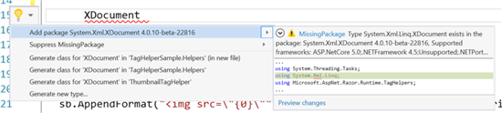
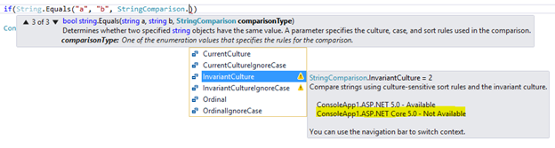
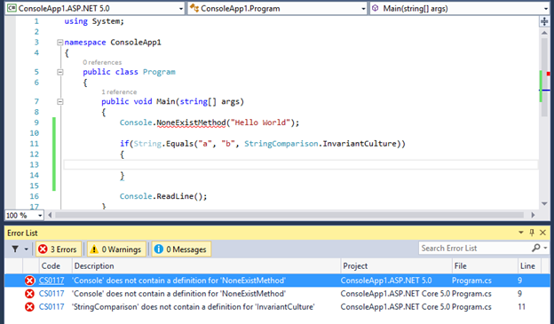
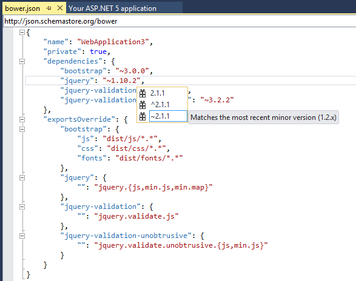
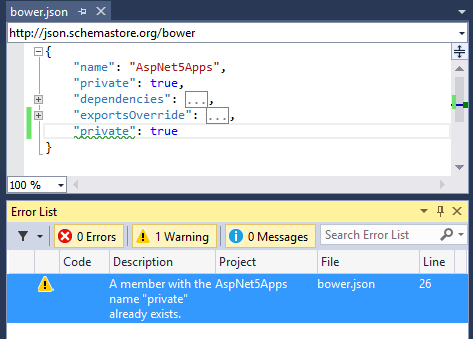

<properties
    pageTitle="ASP.NET and Entity Framework"
    description="ASP.NET 5 and Entity Framework 7 have been optimized for cloud deployments by reducing their memory footprint and increasing their throughput. They are open source and cross platform and are able to run on the traditional .NET Framework 4.6 as well as the new cloud-optimized .NET Core 5. Visual Studio 2015 also has many enhancements for client-side web development."
    slug="servernetfx"
    order="200"    
    keywords="visual studio, vs2015, vs, visualstudio, cross-platform, server, linux, windows"
/>

## ASP.NET 5 Beta 5

[ASP.NET 5](http://www.asp.net/vnext) is an open source web framework for building modern web applications that can be developed and run on Windows, Linux and the Mac. It includes the MVC 6 framework, which now combines the features of MVC and Web API into a single web programming framework. With ASP.NET 5 you gain the following foundational improvements over earlier versions of ASP.NET:

- Build and run cross-platform ASP.NET apps on Windows, Mac and Linux
- Runs on [.NET Core](netcore) and Mono, in addition to .NET Framework 4.5.1 and later, including [.NET Framework 4.6](../../windows2015/windowsnetfx)
- Single aligned web stack for Web UI and Web APIs
- New tooling that simplifies modern Web development
- Cloud-ready environment-based configuration
- Integrated support for creating and using NuGet packages
- Built-in support for dependency injection
- Ability to host on IIS or self-host in your own process

ASP.NET 5 also runs on . For more information about Beta 5, see [ASP.NET 5 Beta5 Now Available](http://blogs.msdn.com/b/webdev/archive/2015/06/30/asp-net-5-beta5-now-available.aspx).

## ASP.NET 4.6

[ASP.NET 4.6](http://blogs.msdn.com/b/webdev/archive/2015/04/30/updates-for-asp-net-4-6-web-forms-mvc-5-web-api-2.aspx) is an umbrella term used to describe updates to existing Frameworks such as ASP.NET Web Forms, MVC 5, Web API 2, etc. You can build Web Apps using these Frameworks on the standard, desktop-enabled .NET Framework model. ASP.NET 4.6 includes the following improvements over earlier versions:

- Easier authentication with Azure Active Directory
- Updates for MVC 5 and Web API 2
- Async model binding for Web Forms
- Updated Web Forms controls to work with Entity Framework 6
- Updated AJAX Control Toolkit
- Support for HTTP/2

## Entity Framework 7 Beta 5

[Entity Framework 7](https://github.com/aspnet/EntityFramework/wiki) introduces significant changes and improvements over EF 6.x, and therefore the pre-release phase of EF7 is much longer than other recent releases. EF7 can be used in the .NET Framework, .NET Core (including ASP.NET 5) and Mono apps.

Here is a rough guide to what currently works in Beta 5. Most of these features are a work-in-progress and still have limitations.

- Basic modeling including built-in conventions, table/column mapping, and relationships
- Change tracking
- LINQ queries
- Table based Insert/Update/Delete (including batching)
- Migrations and database creation/deletion
- Transactions (including automatic transactions during SaveChanges and explicit transaction APIs)
- Identity and Sequence patterns for database-generated key values
- Raw SQL commands
- Reverse engineering a model from a database
- Logging
- Unique constraints including the ability to use them as keys in a relationship

## Entity Framework 6

[Entity Framework 6](https://entityframework.codeplex.com/) is the latest stable version of Entity Framework and is the recommended version for production applications. EF 6.1.3 is a patch release containing fixes for high priority issues that were reported on EF 6.1.2. Visual Studio 2015 includes the RTM version of Entity Framework 6.1.3 runtime and tooling.

The EF runtime will be installed if you create a new model using the Entity Framework Tools in a project that does not already have the EF runtime installed.

The runtime is pre-installed in new ASP.NET projects, depending on the project template you select. The EF 6.1.3 Tools for Visual Studio 2015 are included to make sure you get the latest bug fixes and improvements.

For more information EF 6.1.3, see the blog post[Entity Framework 6.1.3 RTM Available](http://blogs.msdn.com/b/adonet/archive/2015/03/10/ef6-1-3-rtm-available.aspx).

## Project templates for ASP.NET 5

- **New templates:** The "New ASP.NET Project" dialog for C# includes "ASP.NET 5 Empty" and "ASP.NET 5 Starter Web" templates. The "New Project" dialog under "Visual C#"/Web includes "ASP.NET 5 Class Library" and "ASP.NET 5 Console Application" templates.
- **Web project template:** The ASP.NET 5 web project template contains a layout to optimize for both static content and for package restore from NPM and Bower. The template puts static contents under the wwwroot folder that is determined by the webroot element of project.json.
- **Starter Web template and Entity Framework:** The ASP.NET 5 Starter Web template includes Entity Framework 7.
- **Starter Web template and command-line scaffolding:** You can use command-line scaffolding with the ASP.NET 5 Starter Web template because "gen":"Microsoft.Framework.CodeGeneration" is specified in the project.json file's `commands` element.

## Project and build system for ASP.NET 5

- **Project.json file:** Visual Studio 2015 uses the project.json file for reference and package dependencies, version definitions, framework configurations, compile options, build events, package creation meta-data, and run commands, as well as other details. This enables the project to be edited and run in Linux and on MacOS machines that do not have Visual Studio.
- **.xproj file:** ASP.NET 5 projects use the <projectName>.xproj file as Visual Studio's project file. Unlike the old .csproj and .vbproj files, the .xproj file doesn't specify any files from the current directory or sub-directories as "included in the project." Visual Studio automatically includes files located in the ASP.NET 5 project directory files and monitors changes in real time.
- **Solution Explorer support for Bower and NPM:** ASP.NET projects integrate Bower and NPM into Solution Explorer, under a new dependencies node. You can uninstall a package through the context menu command, which will automatically remove the package from the corresponding JSON file.
- **Solution Explorer support for project.json file:** In the Solution Explorer window of an ASP.NET 5 Application, the References node displays all frameworks defined in the project.json file.
- **Project properties page support for runtime information:** The Project Properties page of an ASP.NET 5 project is a tool window and can be used to specify the runtime target version, the debug target, and whether binaries and NuGet packages should be created during a Visual Studio build.
- **Fast build time:** Visual Studio uses the Roslyn engine to compile ASP.NET 5 projects at design time. Therefore, the project has already been compiled when you issue a "build" request. Visual Studio 2015 simply passes the design time compiler output to the build request. This avoids another build and improves performance when you build, run, or debug ASP.NET 5 projects.
- **xUnit support:** Visual Studio supports running and debugging for ASP.NET 5 xUnit tests through Test Explorer. All you need to do is add the xUnit dependencies and test commands to the test project's project.json file.
- **Task Runner support:** Task Runner Explorer can be enabled by selecting the gruntfile.js file's context menu item Task Runner Explorer, or via Visual Studio's menu system: View > Other Windows > Task Runner Explorer.

## New project dialog for ASP.NET

The new ASP.NET Project dialog in Visual Studio 2015 clearly distinguishes ASP.NET 4.6 and ASP.NET 5, making it easy to choose which type of app you want to build. The ASP.NET 5 section has fewer choices since more of the scenarios are integrated. For example, you can opt to make your Web API a Mobile service at any time.

## NuGet package discovery

In Visual Studio 2015 you can resolve NuGet package references in a similar way as you can resolve missing namespace references for types. This makes it easier to copy some code from a place like StackOverflow and resolve type and package references quickly and easily. 

In the example below, the XDocument type (just the text XDocument) is resolved to its type definition with a simple "CTRL .". The using statement is added to the file, and the System.Xml.XmlDocument NuGet package is added to the project.

## IntelliSense and error list

An IntelliSense item that exists in one framework, but not in another will be listed in the IntelliSense with a warning sign. The IntelliSense tooltip indicates which framework supports it and which framework doesn't.

Build errors show which target framework the error is from. So, if you have an error in the code that is recognized by two targeting frameworks, it will show in two places in the error and output error list, with the same description and file location, but with different project names which includes the framework name.

You can use `#if` compiler directives with framework names such as DNX451 or DNXCORE50 to write code that only runs on one frramework, and you can switch the framework you get errors for by selecting the framework in the drop-down list at the top left of the code window.

## JSON Editor

Visual Studio 2015 makes improvements in the JSON editor, including performance improvements such as loading JSON schema asynchronously, caching of child schemas, and better IntelliSense. Here are some other new features:

- **JSON Schema validation:** Add JSON schema validation feature, based on the schema that is defined in the schema drop-down list.
- **Un-minify context menu:** Right-click the JSON editor and select Un-minify context menu to un-minify any long arrays in the JSON file.
- **Reload Schemas context menu:** Visual Studio caches the schema that is downloaded from the Internet and will use the cache even after you restart Visual Studio. If you know the schema is changed, you can use the context menu Reload Schemas Ctrl+Shift+J to re-download the current used schema in the active JSON document, and then use it immediately on the current document.
- **IntelliSense for package.json/bower.json:** In addition to providing IntelliSense and validation for both package.json and bower.json files, Visual Studio also provides live IntelliSense for both Bower and NPM packages directly within the JSON editor

    
- **Duplicate property validation:** This helps catch this common problem with JSON file authoring.
  
    

## HTML Editor

In addition to updated IntelliSense for web standards, the HTML editor in Visual Studio 2015 has the following new features:

- **Better client template formatting:** The HTML editor does not parse or format double-curly syntax {{…}}. This is to make sure that the content of that syntax is not treated as HTML, which would result in incorrect reporting of syntax errors; nor does it try to format them, which cannot be done correctly by using the HTML formatter. This is great for Angular, Handlebars, Mustache, and other double-curly template syntaxes.
- **Support for custom elements, polymer-elements and attributes:** The HTML Editor no longer validates unknown attributes for custom elements, as there will be many custom made tags in different frameworks. Therefore, there are no longer squiggles under the unknown elements.
- **Basic IntelliSense for <link rel="import">:** This is part of the Web Components standard.
- **HTML element tooltips:** Tooltips are supplied for HTML elements in the editor.
- **#region support:** You can use region folding and also use surrounding snippets to surround the current selection.
- **Todo/Hack comment support in Task List:** The HTML editor supports Todo, Hack etc. comment tokens and displays them in Task List.
- **Angular icons:** Both Angular directives (ex. <ng-view>) and attributes (ex. ng-controller) show in IntelliSense with an Angular logo to make it easy to identify them.
- **Bootstrap icons:** The IntelliSense provided in HTML class attributes shows the Bootstrap logo if the class name was defined by the Bootstrap CSS file.

## CSS/LESS/Sass Editor

- **Todo/Hack comment support in Task List:** The CSS/LESS/Sass editor now supports Todo, Hack etc. comment tokens and displays them in Task List.
- **@viewport fix for LESS editor:** In the LESS editor, @viewport will not show verification warnings anymore.
- **More snippets:** The CSS/LESS/Sass Editor now provides more snippets to ease the development experience.

## Other web tooling Updates

- **Browser Link: CSS automatically synchronous:** Saving a CSS file or changing it externally (such as by using a LESS/SASS compiler) causes the whole CSS file to reload in the browser. If the file is in a state where it cannot auto-sync, Ctrl + S will cause a reload, and this puts it back into a good state without having to refresh the linked browsers (Ctrl + Alt + Enter). The feature can be disabled in the toolbar.
- **WebJobs Tooling:** Visual Studio supports controlling web jobs through the Server Explorer WebJobs node inside an Azure web app in the following ways:
   - Start/Stop Continuous WebJobs.
   - Run On-demand or Scheduled WebJobs.
   - Open a WebJob's Dashboard in the browser.
- **WebJobs SDK:** The WebJobs SDK is pre-installed with the Azure WebJob project templates. 

## ASP.NET 4.6 runtime updates

- **ASP.NET MVC 5.2.2:** Template packages are updated to use ASP.NET MVC 5.2.2. This release does not have any new features or bug fixes in MVC. Web Pages updates give it a significant performance improvement, and all dependent packages have been updated to use this new version of Web Pages.
- **ASP.NET Web API 5.2.2:** This release includes a dependency change for Json.Net 6.0.4. For more information on what is new in this release of Json.NET, see Json.NET 6.0 Release 4 - JSON Merge, Dependency Injection. This release does not have any other new features or bug fixes in Web API. Dependent packages have been updated to use this new version of Web API.
- **ASP.NET Web API OData 5.3.1:** See the [release notes](http://www.asp.net/web-api/overview/releases/whats-new-in-aspnet-web-api-odata-53)for details. 
- **SignalR 2.1.2:** Template packages use SignalR 2.1.2. For more information, see the [SignalR 2.1.2 release notes on GitHub](https://github.com/SignalR/SignalR/releases/tag/2.1.2).
- **Microsoft Owin 3.0 Package:** Template packages use Microsoft Owin 3.0 NuGet packages. For more information, see the [Katana 3.0 release notes](https://katanaproject.codeplex.com/releases/view/113283).
- **NuGet 2.8.3:** Supports DevExtreme project and BizTalkProject are added to 2.8.3. For more information, see the [NuGet 2.8.3 release notes](http://docs.nuget.org/docs/release-notes/nuget-2.8.3).
- **ASP.NET Identity 2.1.0:** Added SignInManager to make it easier to use security features such as Account Lockout, and Two-Factor Authentication for login. For more information, see Announcing RTM of ASP.NET Identity 2.1.0.

