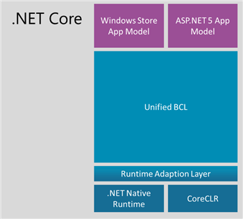
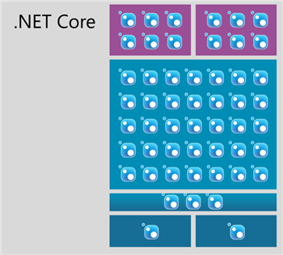

<properties
    pageTitle=".NET Core "
    description=".NET Core is a cloud-optimized, cross-platform open source implementation of the .NET Platform. It currently supports three main operating systems: Linux, Windows and Mac OS X. Developers can also run .NET inside Docker containers on Linux."
    slug="netcore"
    order="100"    
    keywords="visual studio, vs2015, vs, visualstudio, cross-platform, server, linux, windows, .NET, .NET core, DNX, CoreCLR"
/>

.NET Core is a version of .NET for modern device and cloud workloads. It provides a single set of APIs for you to use for your apps. .NET has always offered low-level code portability as a fundamental tenet, and now has an uniform API set that can be used in multiple app types. You don't need to rely on other code sharing techniques to target multiple app platforms, such as portable libraries and shared projects.

## Focus and Value of .NET Core

The focus and value of .NET Core is three-part: deployment, open source and cross-platform. We want to provide a version of .NET that you can use where you want and upgrade it when you want. You can use it on-premise, in Microsoft Azure as well as other cloud providers. You can use it on Windows, Linux or Mac. You can upgrade your apps (including .NET Core itself) to meet your business needs, independent of other apps that are running on a machine. You can modify .NET Core to support new scenarios or add features, and contribute those changes to .NET Core on GitHub. It currently supports x86, x64 and ARM CPUs to support device, cloud and console app scenarios.

.NET Core is essentially a fork of the NET Framework whose implementation is also optimized around factoring concerns. Even though the scenarios of .NET Native (touch based devices) and ASP.NET 5 (server-side Web development) are quite different, we were able to provide a unified Base Class Library (BCL). Currently, .NET Core can be used to develop ASP.NET 5 applications, Windows Universal apps and .NET Core console apps.

ASP.NET 5 is the first workload that has adopted .NET Core. ASP.NET 5 runs on both the .NET Framework and .NET Core. A key value of ASP.NET 5 is that it can run on multiple versions of .NET Core 5 on the same machine. Website A and website B can run on two different versions of .NET Core on the same machine, or they can use the same version. It's your choice. Due to its smaller footprint, there are also some performance benefits that are specific to .NET Core, however, most of the ASP.NET 5 performance benefits apply to both the .NET Framework and .NET Core.

## .NET Core architecture

.NET Core has two major components:
- Runtime: a small runtime that is built from the same codebase as the .NET Framework CLR. The .NET Core runtime includes the same GC and JIT (RyuJIT), but doesn’t include features like Application Domains or Code Access Security. The runtime for ASP.NET 5 apps is called CoreCLR.
- Base class libraries: they are largely the same code as the .NET Framework class libraries, but have been factored (dependencies removed) to enable us to ship a smaller set of libraries. This layer is unified for all .NET Core scenarios.

As we update core components like the GC, JIT and base class libraries, we intend to include those improvements in both the .NET Framework and .NET Core. The use cases for those components are the same in both cases, as is the need for regular improvement. The .NET Core NuGet libraries will follow a similar pattern, running on the latest versions of the .NET Framework and the .NET Core runtime. 

On top of the BCL, there are app-model specific APIs. For instance, the .NET Native side provides APIs that are specific to Windows client development, such as WinRT interop. ASP.NET 5 adds APIs such as MVC that are specific to server-side web development.

We think of .NET Core as not being specific to either .NET Native nor ASP.NET 5 – the BCL and the runtimes are general purpose and designed to be modular. As such, it forms the foundation for all future .NET verticals. Of course, certain components, such as the file system, require different implementations. The NuGet deployment model allows us to abstract those differences away. We can have a single NuGet package that provides multiple implementations, one for each environment. However, the important part is that this is an implementation detail of this component. All the consumers see a unified API that happens to work across all the platforms.

### Self-contained and Efficient

Another major benefit of .NET Core is that it can ship as part of your app. This means that your app is self-contained, with a set of fixed binaries, which includes the .NET Core Framework and runtime. This ensures that your app is unaffected by system updates or other apps that might be updating on the same machine. Your app can also be updated without affecting any other apps. This is especially important for Windows Universal Apps -- where you build and publish a single application that can run consistently on all devices (Tablet, Phone, Desktop, HoloLens, Xbox, IoT, etc). This approach also ensures that new features in .NET Core and C# language improvements are consistently available for you to pick and choose to use across all these environments.

Apps often rely on many .NET Core libraries, such that a lot of self-contained apps might seem like too much of a good thing. This is particularly important for constrained device environments. .NET Native solves this problem by optimizing apps to include only the code that a given app relies on. If you only rely on one type within an assembly, that's the only type that will be retained in your final app. .NET Native has other optimizations that further slim down your overall app.

.NET Native is currently scoped to Windows Universal apps, however, it is intended to fit in as a deployment option for .NET Core apps generally.

## Delivering .NET Core

In contrast to the .NET Framework, the .NET Core platform will be delivered as a set of NuGet packages. You can acquire the packages easily within Visual Studio or with one of the NuGet clients directly. In order to continue our effort of being modular and well factored, we don’t just provide the entire .NET Core platform as a single NuGet package. Instead, it’s a set of fine grained NuGet packages:

For the BCL layer, we’ll have a 1-to-1 relationship between assemblies and NuGet packages, where the NuGet package has the same name as the assembly. For example, immutable collections which was delivered in a NuGet package called Microsoft.Bcl.Immutable is now in a package called System.Collections.Immutable.

In addition, .NET Core uses semantic versioning for our assembly versioning. The version number of the NuGet package aligns with the assembly version. The alignment of naming and versioning between assemblies and packages help tremendously with discovery. There is no longer a mystery which NuGet packages contains System.Foo, Version=1.2.3.0 – it’s provided by the System.Foo package in version 1.2.3.

NuGet allows us to deliver .NET Core in an agile fashion. So if we provide an upgrade to any of the NuGet packages, you can simply upgrade the corresponding NuGet reference.

Delivering the framework itself on NuGet also removes the difference between expressing 1st party .NET dependencies and 3rd party dependencies – they are all NuGet dependencies. This enables a 3rd party package to express, for instance, that they need a higher version of the System.Collections library. Installing this 3rd party package can now prompt you to upgrade your reference to System.Collections. You don’t have to understand the dependency graph – you only need to consent making changes to it.

The NuGet based delivery also turns the .NET Core platform into an app-local framework. The modular design of .NET Core ensures that each application only needs to deploy what it needs. We’re also working on enabling smart sharing if multiple applications use the same framework bits. However, the goal is to ensure that each application is logically having its own framework so that upgrading doesn’t interfere with other applications running on the same machine.

Our decision to use NuGet as a delivery mechanism doesn’t change our commitment to compatibility. We continue to take compatibility extremely seriously and will not perform API or behavioral breaking changes once a package is marked as stable. However, the app-local deployment ensures that the rare case where a change that is considered additive breaks an application is isolated to development time only. In other words, for .NET Core, these breaks can only occur after you upgraded a package reference. In that very moment, you have two options: addressing the compatibility glitch in your application or rolling back to the previous version of the NuGet package. But in contrast to the .NET Framework, those breaks will not occur after you deployed the application to a customer or the production server.

## Enterprise ready

The NuGet deployment model enables agile releases and faster upgrades. However, we don’t want to compromise the one-stop-shop experience that the .NET Framework provides today.

One of the great things of the .NET Framework is that it ships as a holistic unit, which means that Microsoft tested and supports all components as a single entity. For .NET Core we’ll provide the same experience. We’ll create the notion of a .NET Core distribution. This is essentially just a snapshot of all the packages in the specific version we tested them.

The idea is that our teams generally own individual packages. Shipping a new version of the team’s package only requires that the team tests their component, in the context of the components they depend on. Since you’ll be able to mix-and-match NuGet packages, there can obviously be cases where certain combinations of components don’t play well together. Distributions will not have that problem because all components are tested in combination.

Although .NET Core is delivered as a set of NuGet packages, it doesn’t mean that you have to download packages each time you need to create a project. We’ll provide an offline installer for distributions and also include them with Visual Studio so that creating new projects will be as fast as today and not require internet connectivity in the development process.
While app-local deployment is great for isolating the impact of taking dependencies on newer features, it’s not appropriate for all cases. Critical security fixes must be deployed quickly and holistically in order to be effective. We are fully committed to making security fixes as we always have for .NET.

In order to avoid the compatibility issues we have seen in the past with centralized updates to the .NET Framework, it’s essential that these only target the security vulnerabilities. Of course, there is still a small chance that those break existing applications. That’s why we only do this for truly critical issues where it’s acceptable to cause a very small set of apps to no longer work rather than having all apps run with the vulnerability.

## Open Source

In order to take .NET cross platform in a sustainable way we decided to open source .NET Core. The .NET Core project is under the stewardship of the .NET Foundation, which is an independent organization designed to foster the development and collaboration of open source technologies for .NET. We believe that is a critical part in promoting and advancing the .NET Core stack. We’ve setup our development environment so that the public GitHub repository is the leading system. 

The two biggest reasons to open source .NET Core were:
1.	Build and leverage a stronger ecosystem: an open and transparent development process that allows the community to participate in code reviews, read design documents, and contribute changes to the product.
2.	Lay the foundation for a cross platform .NET: the goal of .NET Core is having a single code base that can be used to build and support all the supported platforms.

You can get involved by going to [associated open source project](https://github.com/dotnet/core/blob/master/README.md).

## .NET Execution Environment (DNX)

The .NET Execution Environment (DNX) is a software development kit (SDK) and runtime environment that has everything you need to build and run .NET applications for Windows, Mac and Linux. It provides a host process, CLR hosting logic and managed entry point discovery. DNX was built for running cross-platform ASP.NET Web applications, but it can run other types of .NET applications, too, such as cross-platform console apps.

DNX provides the following benefits:
- Create single application that can work on multiple operating without cross compiling (Windows, Mac, Linux)
- Create applications that can run from source without a build step enabling development with just simple text editors (Sublime, Emacs, VIM, Visual Studio Code).
- Enables debugging from source for referenced NuGet packages.
- Straightforward acquisition of .NET runtimes (e.g. .NET Core).
- Manage multiple .NET runtimes on a single machine both globally or app centric including security updates.
- Supports ASP.NET 5 and .NET Core console app workloads.

DNX is a general .NET Core concept and facility. It's the easiest way to acquire and use the new open source and cross-platform version of .NET.

Note: DNX is not the only SDK for .NET Core. .NET Native, for example, is another one.

You can learn more about DNX by visiting:
- [DNX](http://dotnet.readthedocs.org/en/latest/dnx/index.html)
- [ASP.NET 5 apps](https://github.com/aspnet/home)
- [.NET Core console apps](https://github.com/dotnet/coreclr/blob/master/README.md#get-net-core)

