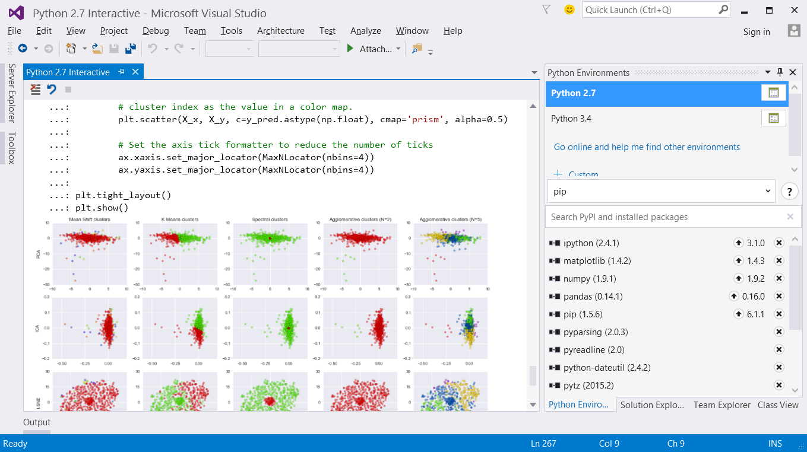
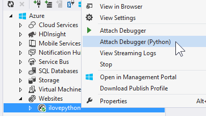

<properties
    pageTitle="Python Tools"
    description="Python is a programming language that you can run on various platforms including Windows, Linux, Unix, and Mac OS X. With Python Tools for Visual Studio, developers can take advantage of an official Microsoft open-sourced extension that enables first-class Visual Studio tooling support for Python projects."
    slug="python"
    order="300"    
    keywords="visual studio, vs2015, vs, visualstudio, cross-platform, server, linux, windows, python"
/>

The Python Tools for Visual Studio 2.2 is a free, open-source extension adds all the functionality you need to develop and maintain your Python applications in Visual Studio, and deploy to Windows or Linux servers, or to Microsoft Azure.

New features for 2.2 include:

- Code snippets support
- Improved code outlining
- Improved Python environments window
- Automatic code suggestions as you type
- Debugger autos window
- Set environment variables in project settings
- Hit count breakpoints
- Task comments
- Preliminary support for Python 3.5
- Along with many bug fixes and smaller features enhancements.

## Key Features

### Bring your own Python

Bring the power of Visual Studio to your favorite Python interpreter! Python Tools for Visual Studio works best with [CPython](http://www.python.org/), but you can also use [IronPython](http://www.ironpython.net/), and other programs that host Python. Or download a Python distribution bundle like [Anaconda](https://store.continuum.io/cshop/anaconda/) or [Canopy](https://www.enthought.com/products/canopy/) and start exploring the Python library ecosystem.

### IntelliSense

Experience powerful IntelliSense that understands Python and provides useful completions for your own code and any libraries you are using.

### Debugging

Python support in Visual Studio’s interactive debugger means you can enjoy stepping through your code with breakpoints, visualizers, and automatic exception notifications. Get to the root of problems quickly and easily with familiar Visual Studio tools. Advanced features include mixed mode (Python/C++) debugging and cross OS (Linux/MacOS) debugging.

### Iterate quickly with the Interactive Window

Use the Interactive Window to quickly iterate while developing. Take advantage of [IPython](http://www.ipython.org/) and [matplotlib](http://matplotlib.org/) integration for an interactive graphical workbench.

### Integrate with Azure

Visit the Microsoft Azure Python Developer Center for tutorials and documentation to get started. The free, open-source Python Azure SDK is an easy way to start using the Azure Management, Storage and Service Bus services directly from your Python code. Access the Azure availability, performance and usage tools by using the Application Insights SDK for Python. Include the Azure DocumentDB service in your project by using azure-documentdb-python. Use Azure Active Directory for OAuth authentication on a Python web site by following the example in azure-python-authenticate.

### Create instant web sites

Create, test, and deploy web sites written with Python and debug them from your desk while they run on your Linux or Windows-based server or on Microsoft Azure.

