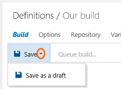

<properties
    pageTitle="Build"
    description="No matter what tools you use. In whatever language you prefer. Team Foundation Build (TFBuild) 2015 builds your app, your way, for your platforms. Just open your web browser to tell us how you want it done."
    slug="buildvnext"
    order="400"    
    keywords="visual studio, team foundation server, visual studio online, vs2015, vs, visualstudio, tfs, vso"
/>

## Build for your platform, speaking your language

Build for Windows, iOS, Android, Java, or Linux using the same domain-specific languages (DSL) you use every day on your dev machine.

## Cross-platform builds 

Build native iOS, Android, Java and Linux out of the box. Java builds can incorporate Ant, Maven, and Gradle.

## Xamarin support
  
Build Xamarin apps for iOS and Android, and Windows Phone, with support for running tests on Xamarin's Test Cloud as part of the build and publishing the Test Cloud test results back to VSO/TFS.

## Easy customization 

Edit in the web and leverage existing knowledge of popular script languages. No need to ramp up on XAML workflow to customize the build. 

 

## Extensible tasks and build engine

If you need to add a task we don't currently offer, you can create your own activity using our [open source activities](https://github.com/Microsoft/vso-agent-tasks) as examples of best practices. 

You can deploy our open-source Node.js [cross-platform build agent](https://github.com/Microsoft/vso-agent) on Mac and Linux systems.

## Real-time build status 

Live console view in the web with real time status of each task.

 

We also provide real time status and time breakdowns project by project:

## Definition auditing and diff

Know who changed what in the build definition and when they did it.

## Elastic use of self-updating resources

Agents can span team project collections. Side-by-side installs and remote agents are xcopy (download from the web UI). No need to install TFS on your build machines.

You can stop running around and worrying about updating your build agents when we release a new version. Visual Studio Online (or your on-premisies Team Foundation Server) automatically distributes agent updates, leaving in place whatever capabilities (such as compilers, SDKs, or tools) you've installed on those machines.

## Better control of agent routing

Definitions route to the right agent with capabilities needed by the definition.

## Secret variables

Lock a variable to hide it from the web and store it in a strong box.

## Azure continuous deployment improved

Supports publish multiple web sites and cloud services in a definition. 

Also, you can deploy from on-premise TFS to Azure.

## CI improved

Monitor and track multiple branches. Associate your builds with each branch.

## Build matrix

Multiply build jobs by any set of variables. Optionally run in parallel across multiple agents.

## True templates

Most build scenarios are new definition, couple inputs, go. Save as custom templates.

## Definition drafts

To test some changes that are not yet ready for production, save a draft.

When you're ready you can publish and keep the changes or delete them.

## Clone definitions

Definitions can be cloned.

## Additional features

- **Auto updating build agents:** There's no need to run around and update all your build agents any more.  The server/service will automatically distribute agent updates. This won't change any of the tools (compilers, etc) just the build automation agent.
- **Seamless integration with XAML builds:** New definitions and the earlier XAML build definitions now share the same Build tab and can coexist happily.
- **Build Java projects:** Ant, Maven, Gradle.
- **Run unit tests and publish results:** There is a task to run unit tests using just about any framework you like (NUnit, MSTest, JUnit, etc.), publish the test results back to VSO/TFS, and include them in the build report.
