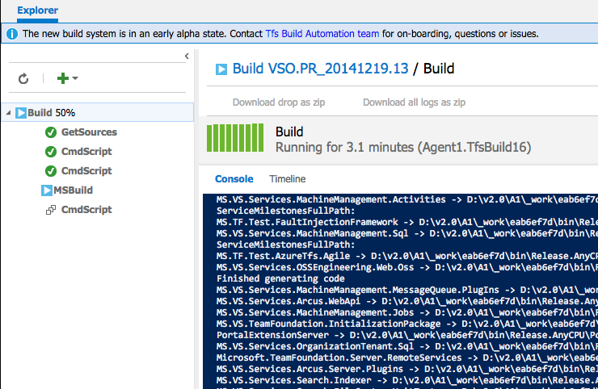
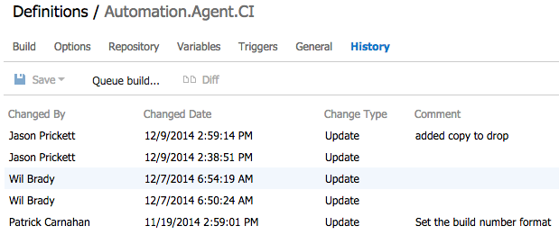
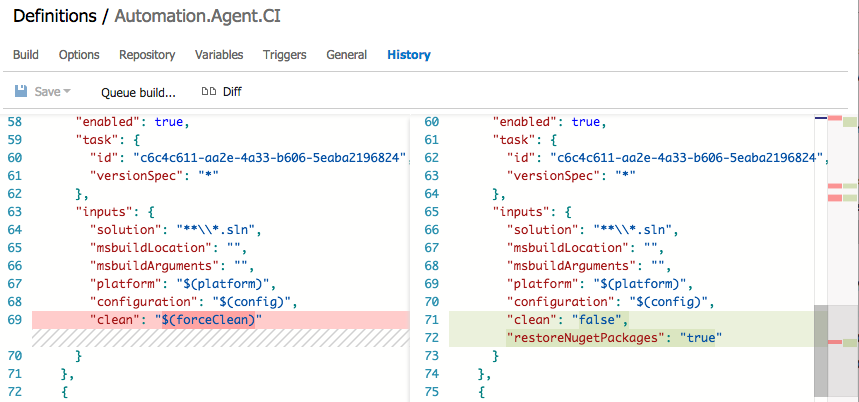

<properties
    pageTitle="Build.Preview"
    description="The next generation of build will enable teams to more easily create custom-build workflows by introducing reusable tasks and leverages a lightweight, Web-based authoring environment."
    slug="buildvnext"
    order="400"    
    keywords="visual studio, team foundation server, visual studio online, vs2015, vs, visualstudio, tfs, vso"
/>

The new build system of Visual Studio Online and TFS will be capable of building code from external systems such as GitHub by leveraging the REST APIs and service hooks infrastructure available in Visual Studio Online. In addition, a new cross-platform build agent will allow teams to run builds on non-Windows machines. This makes it possible, for the first time, to build on Linux and Mac OS X machines. Team Foundation Server 2015 also includes in-box support for Ant, Maven, and Gradle.

What does this mean for your existing investments in Team Build? Moving forward, the build automation features that shipped in TFS 2010, 2012, 2013 and Visual Studio Online based on the Windows Workflow engine will be referred to as XAML Builds. TFS 2015 and Visual Studio Online will continue to support the XAML Build templates and controllers. This means that when you upgrade your on-premises servers, everything will continue to work just as it does today. The two build systems run side by side and do not interfere with each other.

## Easy customization 

There is no need to ramp up on a platform specific build DSL. You can simply pick from a selection of build steps and set a few properties. You will have the ability to create your own tasks or import tasks from the community. These tasks will be instantly available for your users.

 

## Real-time visibility of builds 

See the status of your build in real time from your web browser. The console view gives you a very similar experience to watching your build in your command shell.

 

## Cross-platform builds 

Build native iOS, Android, Java and Linux out of the box. Java builds can incorporate Ant, Maven, and Gradle.

## Xamarin support
  
We also support building Xamarin apps for iOS and Android, and the new build system can build Xamarin apps for Windows Phone. We've also added support for running tests on Xamarin's Test Cloud as part of the build, and have enabled publishing the Test Cloud test results back to VSO/TFS.

<TODO: more on this>

## Run unit tests and publish results 

We now have a task to run unit tests using just about any framework you like – NUnit, MSTest, JUnit, etc. – and publish the test results back to VSO/TFS and include them in the build report.

## Compare versions of build definitions 

Quickly see who last changed the build definition and get a sense of what they changed.

 

View the details.

 

All this information gives you an audit trail for your build definitions too.

## Auto updating build agents

There's no need to run around and update all your build agents any more.  The server/service will automatically distribute agent updates.  This won't change any of the tools (compilers, etc) just the build automation agent.

