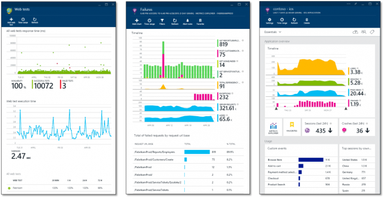
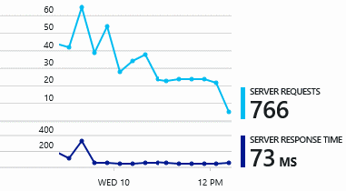
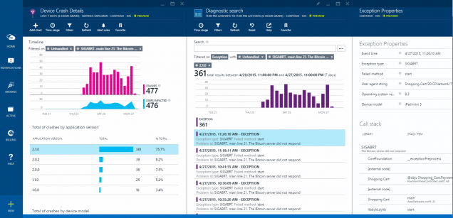
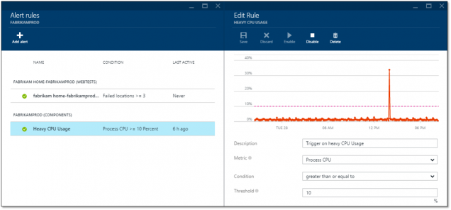
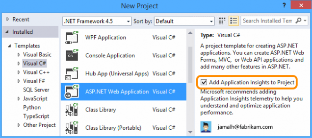
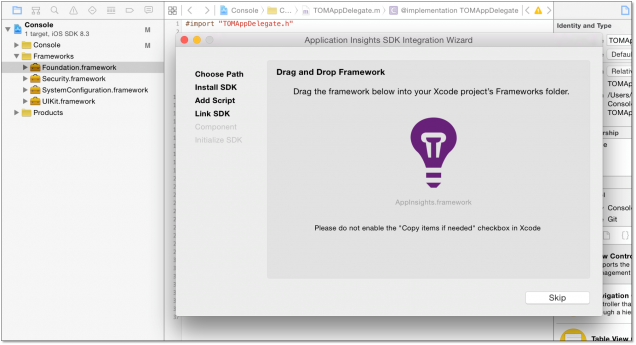

<properties
    pageTitle="Application Insights Preview"
    description="Detect issues, diagnose crashes and track usage in your mobile and web apps on Azure, IIS, and J2EE"
    slug="appinsights"
    order="600"    
    keywords="visual studio, visual studio online, vs2015, vs, visualstudio, vso, application insights, app insights, telemetry, monitoring, analytics"
/>

[Application Insights](http://azure.microsoft.com/services/application-insights/) is an extensible analytics solution that monitors the performance and usage of your live application. It works with both web and stand-alone applications on a wide variety of platforms such as iOS, Android, Windows, .NET and J2EE. 

It is aimed at the development team. With it, you can:

* [Analyse usage patterns](https://azure.microsoft.com/documentation/articles/app-insights-overview-usage/) and measure the success of each new feature.
* [Detect and diagnose](https://azure.microsoft.com/documentation/articles/app-insights-detect-triage-diagnose/) crashes, performance and availability issues.

The SDK for each platform includes a range of modules that monitor the app straight out of the box. In addition, you can code your own telemetry for more detailed and tailored analytics.

Telemetry data collected from your application is stored and analysed in the Azure Portal, where there are intuitive views and powerful tools for fast diagnosis and analysis. 

In addition, your data can be [exported](https://azure.microsoft.com/documentation/articles/app-insights-export-telemetry/) to your own database or analysis tools.

## Platform Support

Application Insights supports a wide range of app types running on devices, servers, or desktops. To use it, you build your app with the appropriate Application Insights SDK. There are versions of the SDK for a growing number of platforms:
 
- Web apps: ASP.NET, Azure Cloud Services, Java, Node.js, PHP, Python, Ruby, Joomla, SharePoint, and WordPress, as well as client-side JavaScript. 
- Hosts: Azure, J2EE, or your own on-premises servers running IIS.
- Android, iOS, and Windows mobile apps; Windows support covers Windows Phone, Windows Store, Windows 10 universal apps, and direct integration with the Windows 10 developer portal.
- Windows desktop apps

Application Insights can also get telemetry from existing ASP.NET web apps on IIS without rebuilding them.

## Usage analytics

[Knowing how your app is used](https://azure.microsoft.com/documentation/articles/app-insights-overview-usage/) is essential to setting priorities.

Out of the box, standard modules in the SDK provide user, session, page view counts and platform data. [Metric charts on the portal](https://azure.microsoft.com/documentation/articles/app-insights-metrics-explorer/) answer your questions such as:

- Am I attracting new users faster or slower than last month?
- What devices, browsers and operating systems are they using?
- Where are they located geographically?

For a more detailed understanding, you can write [custom instrumentation](http://azure.microsoft.com/documentation/articles/app-insights-custom-events-metrics-api/) to find out, for example:

- Are users achieving their goals with my new feature?
- Do they have difficulty with some parts of the experience?
- What paths do they follow?

The telemetry to get this information can be designed as part of each new feature.

## Detect and diagnose performance issues

Response times are a key performance metric, and are automatically measured by the SDKs for web servers. For other types of app, you can write code to measure chosen operations in the same way. 

 

You can also chart the frequency of exceptions or crashes.

If there's a problem, the powerful [search facilities](http://azure.microsoft.com/documentation/articles/app-insights-search-diagnostic-logs/) help you:

* Determine how many users were affected. 
* Find out whether the problem is in your own code or in a [dependency](https://azure.microsoft.com/documentation/articles/app-insights-dependencies/).
* See the details of a crash or exception, and [trace the events](https://azure.microsoft.com/documentation/articles/app-insights-web-monitor-performance/) leading up to the crash. 
* Correlate with usage and [trace logs](http://azure.microsoft.com/documentation/articles/app-insights-search-diagnostic-logs/)

[Email alerts](https://azure.microsoft.com/documentation/articles/app-insights-alerts/) let you know if your app crashes or performs badly. If it's a web application, you can set up [web tests](https://azure.microsoft.com/documentation/articles/app-insights-monitor-web-app-availability/) to monitor its availability.

 

## Single-click instrumentation

Application Insights is easy to add to both new and existing applications, even if they are [already live in production](http://azure.microsoft.com/documentation/articles/app-insights-monitor-performance-live-website-now/). It collects vital application data automatically with practically no effort, and is already part of your development workflow if you are using Visual Studio.

This single-click instrumentation in Visual Studio is available for Windows, ASP.NET, and WCF projects.
 
We take the same approach across a variety of IDEs: Eclipse, IntelliJ, Android Studio, and XCode. Here’s the equivalent tool in Xcode:

 

## Resources 
- [Application Insights documentation](http://azure.microsoft.com/documentation/services/application-insights/)
- [Application Insights service](http://azure.microsoft.com/services/application-insights/)
