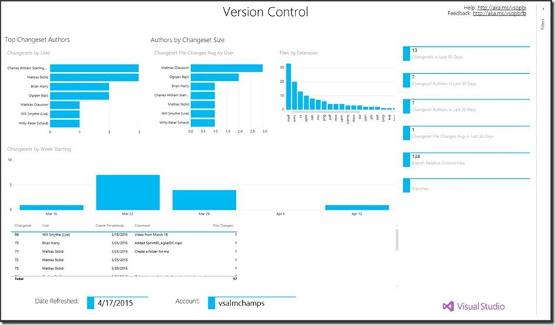

<properties
    pageTitle="DevOps & ALM"
    description="We like to say that Visual Studio Online is not an IDE, it's everything else."
    slug="devopsalm"
    order="600"    
    keywords="visual studio, visual studio online, vs2015, vs, visualstudio, vso, alm, devops"
/>
[Visual Studio Online](https://www.visualstudio.com/en-us/products/what-is-visual-studio-online-vs) delivers continuous innovation services for agile team collaboration and DevOps/Application Lifecycle Management (ALM). Its cloud-powered tools work with your existing IDE or editor, as well as through any browser, so every member of team can work effectively on all types of software projects from anywhere in the world. For up-to-date news on   

Team Foundation Server gives on-premises customers many of these same capabilities, which are delivered through regular TFS updates and roll up into major releases like TFS 2015. The [Visual Studio Online Features Timeline](https://www.visualstudio.com/en-us/news/release-archive-vso) provides a complete reference for what features appear in which service updates to Visual Studio Online and in which updates to TFS.

Key features rolling out in TFS 2015, among many, include the following:

 - A **[new extensibility model](veoextensibility)** including REST APIs, service hooks, and server extensions.
 - **[Improved agile planning tools](agileplanning)** including **[Kanban enhancements](kanban)**.
 - New features for **[source control](sourcecontrol)** to improve process efficiency.
 - The new **[Build.Preview](buildvnext)** system that includes  cross-platform support.

In calendar year 2015, Visual Studio Online is also bringing out a new **[Release Management Service](releasemanagement)**, and Microsoft plans to bring **[Application Insights](appinsights)**, now in preview, to general availability.

These areas are discussed in the separate subtopics for this section. 

## Other Notable Features

There are also a number of other notable features recently released with Visual Studio Online and in TFS 2015.

### *Visual Studio Online and Team Foundation Server*

- **Team project rename:** One of the most highly-requested features is now available, allowing project administrators to rename projects after initial creation. For details including how to manage the implications of a rename, see the documentation on [Rename a team project](https://msdn.microsoft.com/library/vs/alm/tfs/administer/project-rename).

- **SonarQube:** SonarQube is the de facto open source software solution for controlling technical debt. Builds in Team Foundation Server and Visual Studio Online send code analysis and coverage data to SonarQube for deep analysis and problem prioritization. Microsoft's partnership with SonarQube will be improving support for C#/VB and .NET, provide seamless integration with Visual Studio Online and TFS, and simplify installation. 

### *Visual Studio Online only*

- **PowerBI integration:** from the beginning, one of the strengths of Team Foundation Server was a data warehouse that allowed you to mine your development information to gain insights.  For rich analysis through Visual Studio Online, we've introduced the Visual Studio Online data connector that's available on the [PowerBI portal](http://powerbi.com/). In this first increment provides an experience over code information (checkins, pull requests, etc) and works for both Git and Team Foundation Version Control.  We'll be adding support for work items and then more beyond that. 

### *Team Foundation Server only*

- **Expanded Basic license:** users with a Basic license to Team Foundation Server have access to Web-based test execution, team rooms, work item chart authoring, and agile portfolio planning tools. This means that all teams of five or fewer members with a "Basic" license have access to these features using Team Web Access for free, while larger teams can access this functionality at a much lower price point.

- **Project Server Extensions:** TFS Extensions for Project Server enables integration with Project Server 2013. These extensions are similar to the SharePoint Extensions for Team Foundation Server 2013 and need to be installed on all of the front end servers in your SharePoint farm that is supporting Project Server 2013. The Extensions enable teams to create Enterprise Project Plans in Project Server 2013 and sync data between it and Team Projects in TFS. To obtain these extensions, visit the [Downloads page](http://go.microsoft.com/fwlink/?LinkId=517106) and expand the TFS 2015 section.

- **SharePoint Extensions:** In the past, if you wanted your Team Foundation Server integrated with a SharePoint instance that was on a different machine, you could either run the Team Foundation Server installer on the SharePoint server and then configure TFS Extensions for SharePoint or run a special installer (tfs_sharePointExtensions.exe) that put only the bits necessary for configuring TFS Extensions for SharePoint. FOr 2015 we have removed this special installer, so to integrate your Team Foundation Server with SharePoint, you must run the Team Foundation Server installer on the SharePoint server and then configure TFS Extensions for SharePoint. 

- **Assign multiple testers and invite them for testing:** If you have a scenario in which you must invite multiple sign-off owners to run the same set of test cases, you can now assign multiple testers to a test suite. Doing so will pick each test case in the test suite and create a test for each tester who you add to the test suite. You can also send an email inviting them to run tests. When a tester clicks the “View tests” link in the email, a test plan opens that includes a filtered list of tests assigned to that tester.

