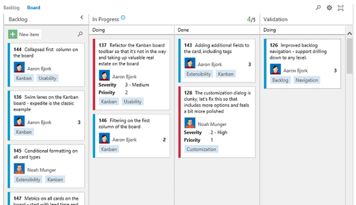

<properties
    pageTitle="Kanban Boards"
    description="Planning, tracking, and executing on work is the heart of any agile process, and Visual Studio 2015 continues to make the process more efficient."
    slug="kanban"
    order="233"    
    keywords="visual studio, team foundation server, visual studio online, vs2015, vs, visualstudio, tfs, vso"
/>

## Find items by filtering on key words 

You can filter the entire board. Enter a filter term in the all-board filter and it will filter by any information displayed on your card, including any fields, tags, or ID that you might have added.

You can edit the "Assigned to" and "Effort" fields on right on the card without opening the work item form, first. Learn more about working with [Kanban boards in TFS]([https://msdn.microsoft.com/Library/vs/alm/work/kanban/kanban-basics).

## Add and edit cards directly on the board

All the cards have an updated look—cards are a bit wider and have a solid white background (instead of a colored background), which allows for customization (see below). This lays the groundwork for more customization options on the cards, including adornments, additional fields, and tags. We’ve also updated all boards to support adding new cards and inline editing. The Kanban board now has a New item button at the top of the first column that adds a new card.

After you add a new card, all data on the card can be edited directly from the card itself. Learn more about [Kanban inline adding and editing](https://msdn.microsoft.com/Library/vs/alm/work/customize/customize-cards).

## Show custom-editable fields and tags on cards 

You can customize how your cards look on your Kanban board and have configuration options for the data showing up on your cards in the Customize Cards dialog box. (A similar customization dialog box is also available for the Task board.)
You can turn the ID on or off, select how the assigned to field is displayed, and choose to show tags directly on your cards. Most people want fields like "title" and "assigned to" on every card, but it's a time saver to bring a bit more information to the cards so you can take action on them without having to open them for more details. For example, notice that we've added both "Priority" and "Severity" to the following bug cards:

The Custom fields added to your cards are directly editable from the board. And, these options are per team (or backlog) and per work item so that you have maximum flexibility. For more details, see [Customize cards](https://msdn.microsoft.com/Library/vs/alm/work/customize/customize-cards) on MSDN.

## Add and reorder items 

You can move items up and down in priority within each column on your board. Any changes made on the board are also reflected directly on the backlog. In fact, with this change, many of you may choose to use the board over the backlog, as the board now supports adding, inline editing, and reordering.

## Implement a pull system by configuring split columns
 
A feature called "Split Columns" lets Kanban teams use a pull model to move work through the board. To do this effectively, each column on your board is split into two subcolumns—Doing and Done. Moving a card into the Done column provides a clear signal that work is ready to progress, and that the card can be pulled by the person/team who owns that next stage. To split any of the columns on your board, simply click the Customize Columns link on the toolbar. To learn more, see [Kanban split columns](https://msdn.microsoft.com/Library/vs/alm/work/kanban/split-columns).

## Expedite work using swimlanes
 
Teams can create horizontal swimlanes to track different classes of work. A classic example is the Expedite lane. So now, each team can create their own lanes, and make the board look just the way they want.

## Help teams be in sync around handoffs by specifying the Definition of done for Kanban columns

As work moves through your board, it's critical that you and your team are on the same page about what "done" means for each column. This release brings a new capability that lets you specify a definition of done for each intermediate column on your board. Columns with a definition now include a small icon in the header that communicates the agreed-upon definition. See [Definition of done](https://msdn.microsoft.com/Library/vs/alm/work/kanban/definition-of-done) on MSDN.

## Remove clutter from the Cumulative Flow Diagram 

You can omit the first column of the Kanban board and get a more meaningful CFD chart. (The first column often represents the long backlog of items a team is working on, but not the items actively on the Kanban board.) To do this, select "Edit" from the CFD chart, and then uncheck the "include first column" checkbox. (And note that for all existing backlogs/CFD charts, this box will be checked by default.)
