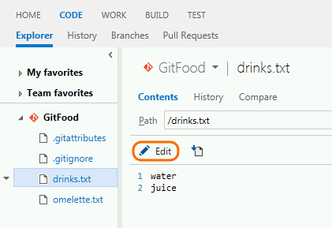
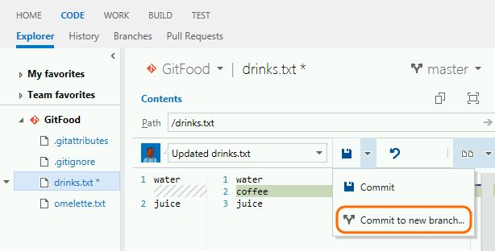
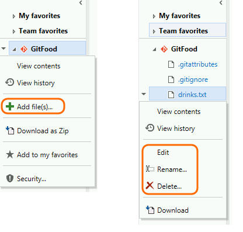
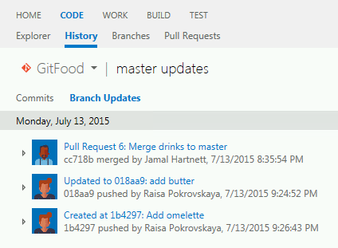
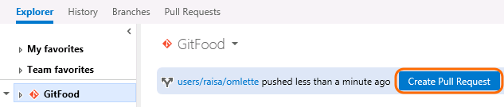
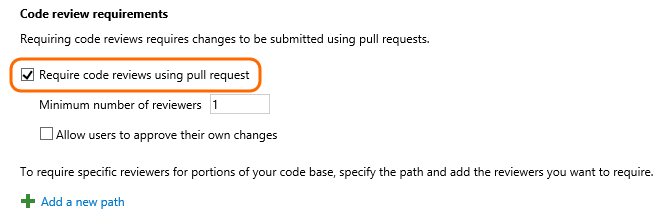

<properties
    pageTitle="Version Control"
    description="With updates in Team Foundation Server 2015 and Visual Studio Online, you have new capabilities for working efficiently with your version control repositories."
    slug="sourcecontrol"
    order="267"    
    keywords="visual studio, team foundation server, visual studio online, vs2015, vs, visualstudio, tfs, vso, version control"
/>

## Web edit

You can make a quick edit to a file in version control directly from your web browser and then commit those changes straight back to the service. When browsing a source file, an Edit command puts the file into editing mode. Changes can then be made inline, complete with color coding and formatting support. As soon as you click the Save command, we create a new commit/changeset with your changes. Use the diff view to see exactly what changes you’re making before committing the changes. If the file is a Markdown or HTML file, you can also preview your changes before you save them.

To make sure your changes are good, compare with the previous commit. When you are ready, commit to a new branch and create a pull request to merge the changes.

You can also add, rename, and delete files.

Note: To add a new folder, you must use a client tool such as Visual Studio.

## New web history view

You can view the history of pushes and pull requests in a branch.

## Pull requests

Instead of merging on your dev machine, create a pull request to make sure your code quality is high before you merge.

Your team can see the code changes, leave comments in the code, and give a "thumbs up" approval if they're satisfied with those changes. 

## Branch policies

Branch policies help teams protect their important branches.

After you configure a branch policy, your team must merge using a pull request. You cannot directly push or merge changes to the branch.

You can specify required reviewers. 

You can also specify that if the build does not succeed, the policy rejects the pull request.

