<properties
    pageTitle="Azure SDK 2.6 and Azure SDK 2.7 for .NET"
    description="The Azure SDK for .NET is a set of Visual Studio tools, command-line tools, runtime binaries, and client libraries that help you develop, test, and deploy apps that run in Azure."
    slug="azuresdk26"
    order="600"
    keywords="visual studio, vs2015, vs, visualstudio, productivity, ide, azure, azure SDK"
/>
Azure SDK 2.6 and Azure SDK 2.7 continues to build on innovations in previous releases, and includes the following for Visual Studio 2015.

[Learn More](https://azure.microsoft.com/en-us/develop/net/) | [Download the Azure SDK for .NET](http://azure.microsoft.com/en-us/downloads/archive-net-downloads/)

### Azure Resource Manager Tools

Azure Resource Manager Templates enable you to define your application resources in a declarative manner. Using JSON the declarative templates can easily integrate into your dev-> test-> release lifecycle. With Azure SDK 2.6 you can now define Azure Resource Manager templates that use Virtual Machines, Networking and Storage.

You can create an Azure Resource Manager Template from File -> New Project -> Visual C# (or Visual Basic) -> Cloud -> Azure Resource Group. When creating a new project you can select from a list of common Azure Gallery templates. Azure SDK 2.6 includes new templates for various Virtual Machine and Network Configurations.

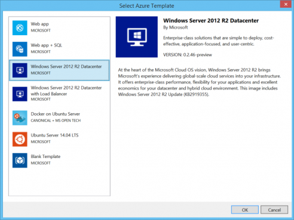

### Improved Resource Manager Template support in the JSON Editor

The Azure Resource Manager tools make it easy to visualize and edit the resources defined in the JSON templates. The template editing experience in Visual Studio includes a new JSON Outline tool window that makes it easier to navigate your template file and add and delete resources.  When you click on an item in the tool window, the JSON editor will automatically scroll to the item in the template file and highlight it.

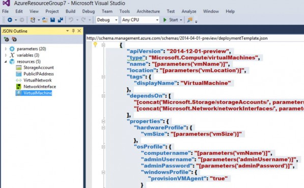

You can easily edit the JSON Template by using toolbar buttons at the top of the JSON Outline window to add and delete resources. The Add Resource button opens a dialog that allows you to pick from many resources. Clicking the Add button will add the JSON required for that resource to your template. You can also specify dependencies for the resource and quickly create templates that deploy a wide variety of resources without having to write the JSON.

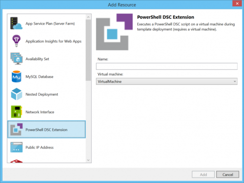

You can deploy your template from Visual Studio by right-clicking on the Azure Resource Group project node in Solution Explorer.  When deploying your template from within Visual Studio, Visual Studio runs the PowerShell script that is included in your resource group project to deploy the template. You can deploy the template independent of your application code. The [PowerShell Tools for Visual Studio extension](http://blogs.msdn.com/b/powershell/archive/2015/04/19/do-not-delete-publish-powershell-tools-for-visual-studio-now-available.aspx) can be used to update and maintain the PowerShell deployment scripts.

You have full control over how your template is deployed and can use the same procedure when deploying from Visual Studio or from command line for automated deployments.

### Diagnostics support in Compute Emulators (Cloud Services)

Azure SDK 2.7 brings back support for collecting diagnostics logs for your Cloud Service in the Azure compute emulator. Application trace logs, Event Tracing for Windows (ETW) logs, performance counters, infrastructure logs and windows event logs generated when the application is running in the emulator can be transferred to development storage to verify that your diagnostics logging is working on your local machine. This enables you to test out your application logging strategy while still developing your application locally with Visual Studio.

Transferring the diagnostics logs to storage emulator can be enabled by setting the diagnostics storage account connection string (Microsoft.WindowsAzure.Plugins.Diagnostics.ConnectionString) to **UseDevelopmentStorage=True**.  This will enable diagnostics data collection and all diagnostics data is collected in the Storage Emulator accessed through Server Explorer under the (Development) node.

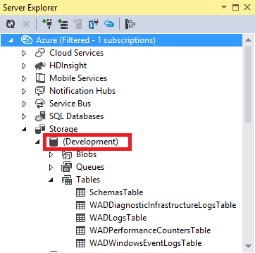

### Configuring diagnostics for multiple environments

The diagnostics storage account connection string (Microsoft.WindowsAzure.Plugins.Diagnostics.ConnectionString) is stored once again in the service configuration (.cscfg) file and can be configured from the Role Designer. This enables you to have a different Diagnostics Storage account for each Service configuration so that your diagnostics data can be transferred to a different storage account based on the service configuration you are deploying with.

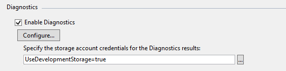

To simplify the process of enabling the Azure Diagnostics extension in an automated deployment when using tools like PowerShell, the Visual Studio package output now includes the public configuration XML needed to configure the diagnostics extension. The public configuration files are created in an **Extensions** subfolder in the package output and follow the pattern **PaaSDiagnostics.<RoleName>.PubConfig.xml**.

These public configuration files are also prepopulated with the storage account name that was specified with the Diagnostics connection string.  Any PowerShell based deployments can use the file naming pattern to map each configuration to a Role and use the configuration along with the storage account name present in the configuration to enable diagnostics for each Role.

Although the diagnostics storage account connection string is similar to the one used with Azure SDK 2.4 there are some notable differences in how it is used in SDK 2.6. For more information on how to use the Diagnostics Storage connection string and how it impacts your projects see [Configuring Diagnostics for Azure Cloud Services and Virtual Machines](http://go.microsoft.com/fwlink/?LinkID=532784).

### Viewing Diagnostics Data

Azure SDK 2.6 improves the experience of viewing diagnostics logs. The Diagnostics summary page for viewing diagnostics data for a role can be accessed by right clicking on the role in Server Explorer and selecting View diagnostics data.

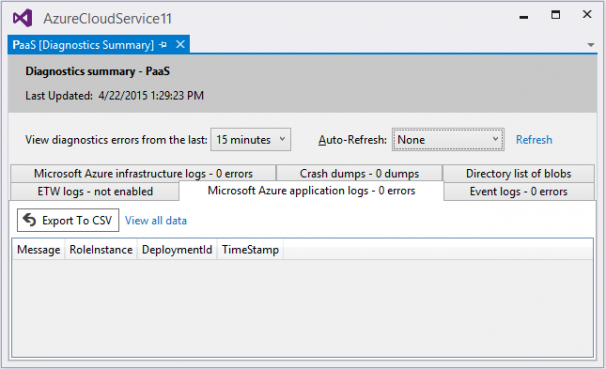

The summary page provides a quick way to diagnose issues in your dev/test environments by displaying the various errors logs from your Role. The summary page now uses a tabular layout to display the different types of logs to allow for more screen real estate to view the log data. You can also set the page to Auto-Refresh at specific intervals so you are always viewing fresh diagnostics data. Lastly you can now export the error logs to a CSV file for analysis in other tools like Excel. The export to CSV functionality is also available in Table Storage explorer enabling you to export all Table storage data to a CSV file.

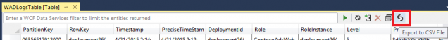

### Richer log analysis using ELK (Elasticsearch, Logstash, and Kibana)

The Visual Studio storage explorer and diagnostics summary page are helpful with diagnosing issues in dev/test environments. For production environments many customers have been adopting Elastic Search, Logstash and Kibana (or ELK) for log search and custom data visualizations over large amounts of log data. To simplify using Azure Diagnostics log data with ELK we have created PowerShell scripts that can help spin up an ELK cluster on Azure as well as pull in the Azure Diagnostics log data to Elastic Search through a Logstash plugin. You can try these out at [http://aka.ms/AzureDiagnosticsElk](http://aka.ms/AzureDiagnosticsElk).

### Azure App Service Tooling Updates

The following items were updated in the Azure SDK 2.6 release.

- Azure publishing enhanced to include Azure API Apps as a deployment target.
- API Apps provisioning functionality to enable users with API App creation and provisioning functionality.
- Server Explorer changed to reflect new App Service node, with Web, Mobile, and API apps grouped by Resource Group.
- Add Azure API App Client gesture added to most C# projects that will enable automatic generation of Swagger-enabled API Apps running in a user’s Azure subscription.

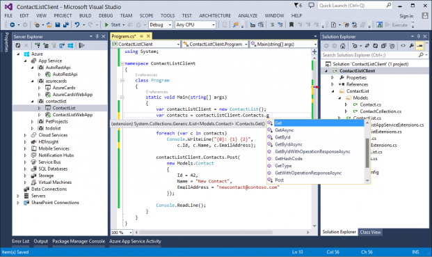

### HDInsight remote metadata suggestion in Hive IntelliSense

HDInsight tools support getting remote metadata when editing your Hive script. For example, you can type **SELECT * FROM** and all the table names for the cluster selected in HDInsight toolbar will be shown. Once a table is specified, column name suggestions for that table are also shown.

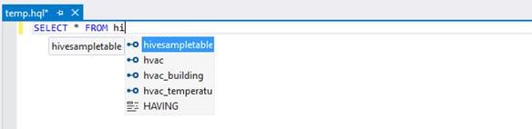

 Note that populating the table or column name might take long when you first create a script since Visual Studio needs to contact to remote server to get the data.

### HDInsight emulator support

You can now connect to the HDInsight emulator from Visual Studio. This enables you to develop your Hive scripts locally without incurring any cost, then execute those scripts against your HDInsight clusters. For more information see: Getting started with HDInsight emulator.

### Support for generic Hadoop clusters (Preview)

With support for generic Hadoop clusters you can use HDInsight Tools for Visual Studio to do the following:

- Connect to your cluster
- Write Hive query with enhanced IntelliSense/auto-completion support
- View all the jobs in your cluster with an intuitive UI

For details about how to connect to an existing Hadoop cluster using HDInsight tools for Visual Studio, see [Getting Started with HDInsight Tools for Visual Studio](http://azure.microsoft.com/en-us/documentation/articles/hdinsight-hadoop-visual-studio-tools-get-started/).

### Add Connected Services

The Connected Services experience in Visual Studio 2015 enables you to easily integrate various platform services into your application. Application Insights is now available from within Connected Services, joining Azure Storage, Azure Mobile Services, Office 365, and Salesforce. The Application Insights Connected Service allows you to easily configure Application Insights to detect issues, diagnose crashes and track usage in your web and mobile apps.

The Add Connected Service dialog now better indicates which services can be added to the current project, using an icon and text to indicate supported projects.  For unsupported projects, a link is provided to request support. To use the Add Connected Service dialog, right click on the References node in Solution Explorer and choose Add Connected Service…

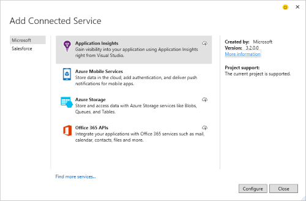

Azure Storage is available as a Connected Service for Azure WebJob projects.  In a WebJob project, the Storage account you add is automatically hooked up for both application data and logging.

### Enterprise Single Sign On

Configuring enterprise single sign on for your web projects using Azure Active Directory is simplified with Visual Studio 2015. Right click on your application and select Configure Azure AD Authentication… to bring up the configuration wizard.

The Configure Azure AD Authentication wizard  supports entering or selecting a domain.  The list of domains is pre-populated from accounts listed in Account Settings.

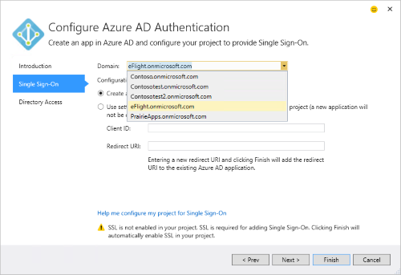

### Service Bus > Event Hubs updates

- Allows targeted access control when sending events by exposing additional publisher endpoint for Event Hubs.
- Additional stability and improvements to Event Hubs feature.
- Support of Amqp protocol over WebSocket for messaging and Event Hubs.

### In-Role Cache updates

In-Role Cache uses Microsoft Azure Storage SDK version 4.3. Until now, the In-Role Cache was using Azure Storage SDK version 1.7. Customers using Azure SDK 2.5 or below should update to Azure SDK 2.6 and move to the new version of Azure Storage SDK. Note that Azure Storage version 2011-08-18 will be removed on December 9th, 2015. For more details read [this announcement](http://azure.microsoft.com/blog/2014/08/04/microsoft-azure-storage-service-version-removal/).

### Cloud Explorer

Cloud Explorer, introduced in Azure SDK 2.7, lets you more easily browse your Azure resources, even from multiple Azure subscriptions, from within the Visual Studio interface. It displays the properties and available actions for the selected resource.

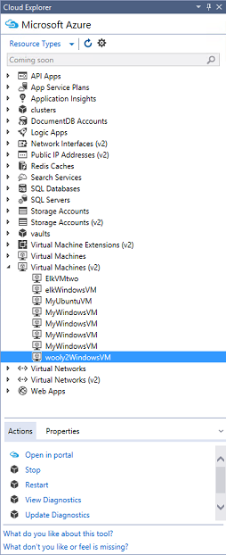

Cloud Explorer is built on the Azure resource manager stack, just like the Microsoft Azure Preview portal. It understands resources such as Azure resource groups and Azure services such as Logic apps and API apps, and it supports role-based access control (RBAC).

### Azure Data Factory Tools

Now included in Azure SDK 2.7 are the Azure Data Factory Tools. The goal is to simplify the Azure Data Factory authoring experience and remove on-boarding and deployment challenges. The Azure Data Factory Tools improve productivity and efficiency for both new and advanced users with tailored experiences and rich tooling. With this release, you can interactively author and deploy data pipelines using the Visual Studio interface. See the [Azure Data Factory blog post](http://go.microsoft.com/fwlink/?linkid=617530) for more information about these tools.
