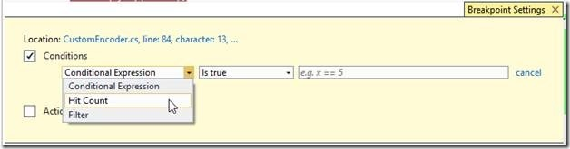
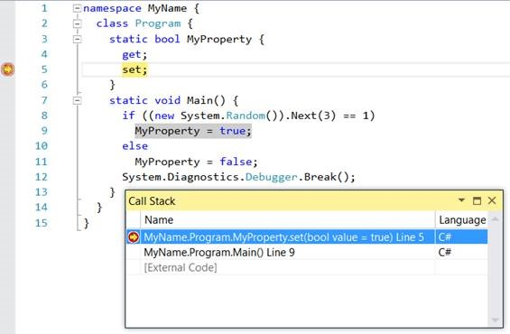
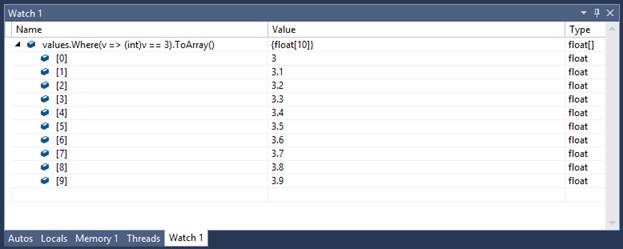
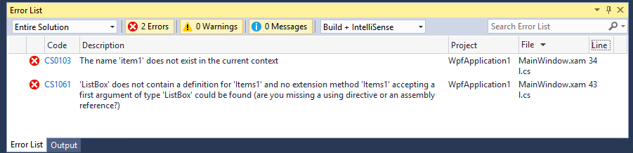
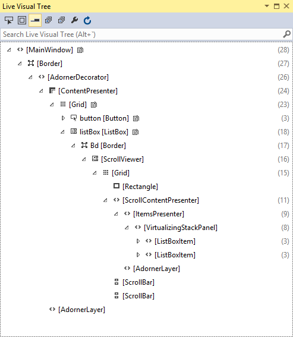
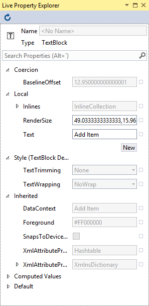
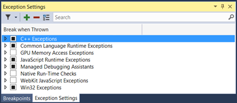
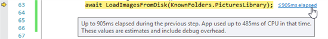
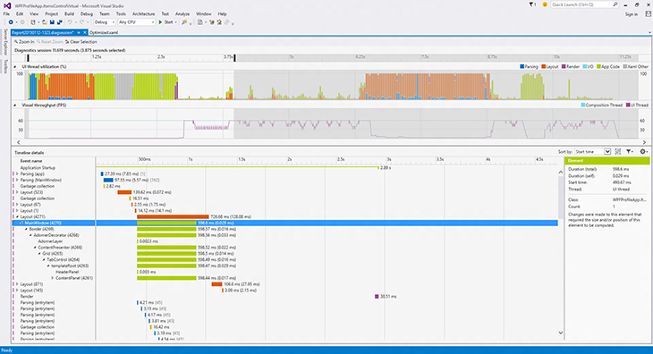

<properties
    pageTitle="Debugging & Diagnostics"
    description="Visual Studio 2015 greatly improves the range of tools that you have for debugging and diagnostics. These include PerfTips, improved breakpoint configuration. lambda debugging support, filtering for errors and warnings, and much more."
    slug="debugdiag"
    order="200"    
    keywords="visual studio, vs2015, vs, visualstudio, productivity, ide, debugging, diagnostics, perftips, intellitrace"
/>

## Debugging

### Breakpoint Configuration

The Breakpoint Settings window allows you to specify conditions and actions for your breakpoints. The window includes added IntelliSense support for breakpoint conditions and actions. You can use undo (Ctrl+Z) to restore deleted breakpoints if they have conditions and actions.
 
Breakpoint configuration also greatly simplifies configuring breakpoints with conditions and actions. This window allows developers to go back and forth between code and breakpoint settings.

### Setting breakpoints on auto-implemented properties
 
Auto-implemented properties are a great convenience feature and this they have been around for a long time. However, there was no debugger support, until Visual Studio 2015, which allows you to set breakpoints in auto-implemented properties and step through the property:

### Lambda debugging support

Lambda support includes in the Immediate and Watch windows. Edit and Continue in the debugger also works with lambdas and async functions.

### Filter errors and warnings

Filtering makes it easier for developers to prioritize corrections. Visual Studio 2015 also includes links on error codes to help developers quickly find the information needed to resolve those errors.  

### Improvements in the C++ Debugger 

When the C++ debugger is stopped at breakpoints, it can execute code in order to compute results, such as to show you data in the Watch and Immediate windows. If the debugger detects that a called function is deadlocked, it will attempt to resolve the issue.

When a C++ debugger launches a process, Windows now allocates memory using the normal heap rather than the debug normal heap. This results in a faster start for debugging. For more information, see [C++ Debugging Improvements in Visual Studio 2015](http://blogs.msdn.com/b/vcblog/archive/2014/10/06/debugging-improvements.aspx).

### Managed Edit and Continue on Attach

You can edit and continue when you attach to .NET applications and when the environment variable complus_forceenc is set to 1 in the target process.

### UI debugging tools for XAML

We've added two new tools—the Live Visual Tree and the Live Property Explorer—that you can use to inspect the visual tree of your running WPF or Windows Store app. You can also inspect the properties of the selected element and make edits which then are pushed to the running application. For details, see the page on [XAML tooling](../../windows/xamltooling). 

Here's the Live Visual Tree:

And here's the Live Property Explorer:

### Exception Settings

You can specify which exceptions should cause execution to break by using the Exception Settings tool window. The new window is non-modal and includes improved performance, search, and filter capabilities.

 

## Diagnostics Tools

Visual Studio 2015 has updated the diagnostic tools window with Events, Memory Usage tool, and CPU Usage graph, all integrated with the debugger and available during regular debugging sessions. 

- Events (with IntelliTrace): Gives you access to all events collected during your debugging session (exceptions, SQL statements, ASP.NET requests, Console.WriteLine etc.). The data is presented both as a timeline and as a tabular view. The two views are synchronized and can interact with each other.
- Memory Usage: allows you to monitor the memory usage of your app while you are debugging. You can also take and compare detailed snapshots of native and managed memory to analyze the cause of memory growth and memory leaks.
- CPU Usage: The CPU Usage tool allows you to monitor the CPU usage of your application while you are debugging.

### PerfTips

PerfTips bring performance awareness into the debugging experience by indicating elapsed time for one or more lines of code as they are run in the debugger. This saves tremendous time over running separate diagnostic tools and navigating the output.

### Application Timeline Tool

The Application Timeline tool, which is in Start Diagnostic Tools Without Debugging…, shows you how much time your application spends in preparing UI frames and in servicing network and disk requests, and it does so in the context of scenarios such as Application Load, Page Load and Window Resize.
 
This scenario centric view of system resource consumption, enables you to inspect, diagnose, and improve the performance of your WPF, Windows Store 8.1 and UWP XAML applications.

  

### Network Diagnostic Tool

This tool helps you diagnose network-related issues when building Windows store apps as well as universal apps that run across all Windows 10 devices, from Windows Phone to Xbox and Windows Store.

The network diagnostic tool records information about your app’s HTTP network operations, including HTTP request and response headers, request and response payloads, cookies and detailed timing information, and more. The network diagnostic tool can also help answer questions about common scenarios, such as:

- Authentication related issues (for example, why you're not able to access a resource)
- Cache related issues (for example, why you're not getting the latest version of a resource)
- How many bytes are downloaded when running common tasks of your apps
- Where are the bottlenecks when accessing and downloading a resource

To access the Network tool, open the Diagnostics Tools window in Visual Studio 2015. On the Debug menu, select Start Diagnostic Tools without Debugging. Alternatively, just press Alt+F2.

### GPU Usage

The GPU Usage tool can be used to understand GPU usage of DirectX applications. Frame Time, Frame Rate, and GPU Utilization graphs are available while the applications are running live. In addition, by collecting and analyzing detailed GPU usage data, this tool can provide insights into the CPU and GPU execution time of each individual DirectX event, and therefore can be useful to determine whether the CPU or GPU is the performance bottleneck.