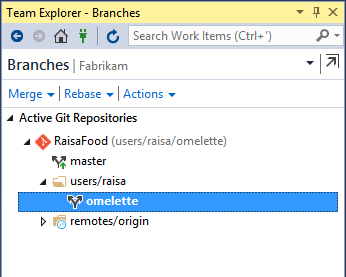
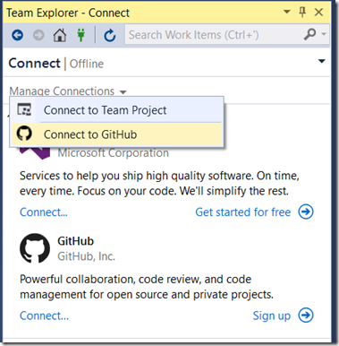

<properties
    pageTitle="GitHub Integration"
    description="GitHub is the most popular source control service on the web, and is now integrated directly within Visual Studio 2015."
    slug="productivitygit"
    order="700"    
    keywords="visual studio, vs2015, vs, visualstudio, productivity, ide, git, github"
/>
## Git version control in Visual Studio

In Visual Studio, you can organize your branches by specifying a prefix:

<TODO: image>

Local branches and remote branches (including those you have not created locally) are shown separately in a tree view.

The Branches page has also been reworked to offer new capabilities:

- You can merge from remote branches, as well as local branches.
- The branch that you are merging into is fixed to the branch that is currently checked out.
- You can rebase from the current branch onto any local or remote branch.
- You can checkout a remote branch by double-clicking it, or right-clicking it and then selecting Checkout.

## Github Extension

The GitHub Extension for Visual Studio lets you clone your existing GitHub repositories, create new repositories, and navigate to important GitHub features like Pull Requests, Issues, and Reports from inside VS. The extension builds on the Git support already in Team Explorer so you get a consistent experience for commits, branching, and conflict resolution no matter what remote repository you set. 

This extension, from GitHub, is directly available as an option in Visual Studio 2015's setup. In addition, GitHub has made it easier to access Visual Studio from GitHub.com with a new "Open in Visual Studio" button.

Clicking the button will launch Visual Studio and start a clone inside the IDE. The Open in Visual Studio button calls a new protocol handler called "git-client://", which allows websites to pass standard Git operations to any IDE that's registered with the OS to handle that protocol.