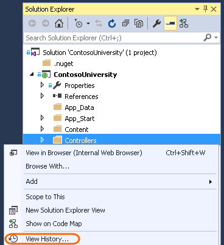
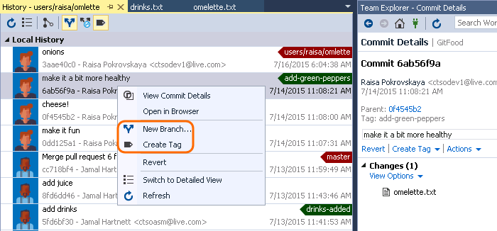
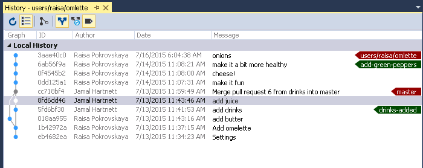
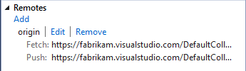
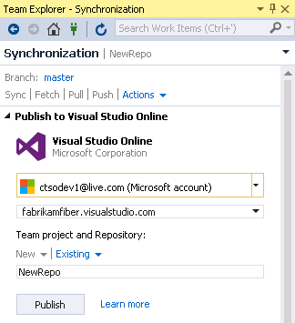

<properties
    pageTitle="GitHub Integration"
    description="GitHub is the most popular source control service on the web, and is now integrated directly within Visual Studio 2015."
    slug="productivitygit"
    order="700"    
    keywords="visual studio, vs2015, vs, visualstudio, productivity, ide, git, github"
/>
## Branches

You can organize your branches hierarchically, using / as a delimiter in the branch name. Local branches and remote branches (including those you have not created locally) are shown separately in a tree view.

The Branches page has also been reworked to offer new capabilities:

- You can merge from remote branches, as well as local branches.
- The branch that you are merging into is fixed to the branch that is currently checked out.
- You can rebase from the current branch onto any local or remote branch.
- You can check out a remote branch that you are not yet tracking by double-clicking it, or right-clicking it and then selecting Checkout.

## Rebase

You can rebase branches.

## History

Right click on any folder in Solution Explorer, the Changes page, or the Commit Details page, and get the history of changes to files within that folder. 

You can create a new branch or tag from the history.

Use the detailed view to see the commit graph and how the commits diverged in the history.

In the graph, merge commits are gray and non-merge commits are a brighter color. If the graph is truncated, you can resize it. 

## Remotes management

You can add, edit, and remove Git remotes from the Repository Settings page.

## Performance and usability improvements

- If you're working in a large repo, you'll see significant improvements in the performance of operations like fetch, checkout, and merge.
- When you authenticate to the first cloud service in Visual Studio, we will automatically sign you in, or reduce the authentication prompts for other integrated cloud services.

## Publish to Visual Studio Online

It's easier to publish a local repo to Visual Studio Online.

From the Synchronization page you can publish to a new or existing Git team project.

