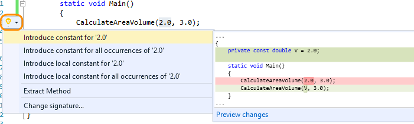
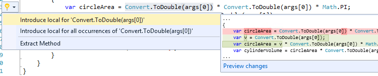
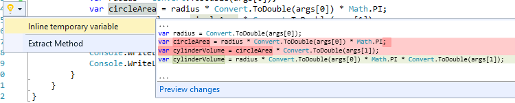
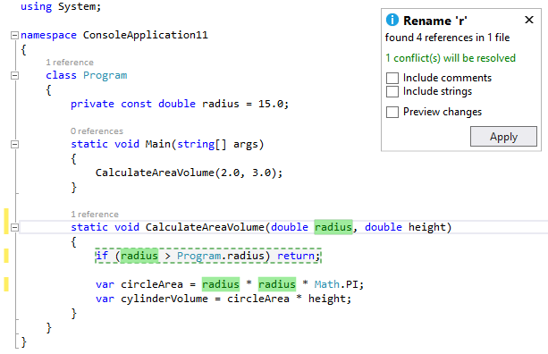
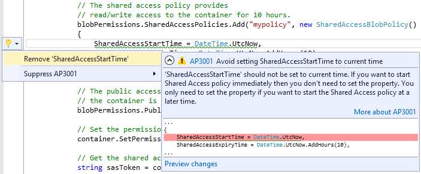

<properties
    pageTitle="IDE Improvements"
    description="TODO"
    slug="ide"
    order="100"    
    keywords="visual studio, vs2015, vs, visualstudio, productivity, ide"
/>

## Code Editor UI and Editing for C# and Visual Basic

The code editor UI and editing experiences for C# and Visual Basic have been replaced with new experiences built on the .NET Compiler Platform ("Roslyn"). Many of the features you love today have been improved or revamped.

- **Light Bulbs** are the home for all quick actions you take in the Visual Studio Editor, including fixes to common code issues and refactoring code. When you have issues in your code, a Light Bulb shows suggested fixes for those issues. All refactoring operations have been moved to the Light Bulb, which you can access any time by typing Ctrl + <dot>.
  

- **Code refactoring: Introduce local**:
  

- **Code refactoring: Inline temporary variable:**     
  

- **Refactoring support for Visual Basic** has been added for the first time, and is accessible through the Light Bulb.
- **Renaming improvements:** it highlights all the instances of the identifier you want to rename, letting you type the new name to all instances at once directly in the editor.
  
 
- **Live code analysis and automatic fixes as you type:** includes with specific code-aware guidance for the Microsoft platforms and NuGet packages that you're targeting. At Preview, you need to add the live FxCop analyzers through a NuGet package you get from the NuGet Gallery, as you would any other package. As you pull in any given live rule, it displaces the equivalent post-build FxCop rule, so you don't get duplicate hits. Here is an example from the Code Analysis for Azure package.
  

- **Rewritten expression evaluator for C# and Visual Basic:** Improvements include support for LINQ and lambda expressions in the Watch and Immediate Windows.

## UI Improvements

- **Custom Window Layouts:** Save custom window layouts by clicking Save Window Layout from the Window menu, and apply a custom layout by clicking Apply Window Layout from the Window menu. You can also apply a layout by using the pre-assigned keyboard shortcuts. The first nine layouts also have keyboard shortcuts from Ctrl+Alt+1 to Ctrl+Alt+9. Other tasks you can perform include deleting, renaming, and reordering  layouts by clicking Manage Window Layout from the Window menu.
- **XAML Designer:** You can your Templates and Styles stored in external resource dictionaries within the context of your usage. This experience has been further refined to use Peek to enable a true in-situ resource editing in the XAML designer.
- **High-Resolution Icons:** Visual Studio 2015 supports high resolution icons in command bars, tool window toolbars (standard), the main menus, error list, status bar, and some Solution Explorer project types when your device is running at greater than 100% DPI scaling. High-resolution icons are also supported for extensions.
- **Menu casing:** Menus appear in Title Case style instead of ALL CAPS style.
- **Touch support:** The Visual Studio editor supports scrolling (tapping-and-dragging on the editor surface on the regular and enhanced scrollbars), pinch-to-zoom, select a whole line by tapping in the editor margin, select words by double-tapping them, and press-and-hold to invoke the editor context menu.
- The **Configuration and Platform dropdown values** for the Visual C++ Property Page dialog remember the last user selection when the property page is closed and reopened.
- **Send a Frown:** offers better tools to report slowness, hangs, and crashes. You can attach files or tag your feedback, to better describe the issue as well. Furthermore, the Feedback icons and menu items have been updated to improve discoverability.
- **Add-ins are no longer supported** in Visual Studio 2015; add-in project templates and the Add-in Manager have been removed. You should convert your add-ins to VSPackage extensions. For more information, see FAQ: Converting Add-ins to VSPackage Extensions.
- **Touch gestures in the Visual Studio editor** give developers flexible input modalities, and are especially powerful with large touch screens in team collaboration environments. Gestures include scrolling, pinch-zoom, line selection, and press-and-hold to invoke context menus.
- **Add Connected Services** makes it easy for developers to consume service APIs in their client and web applications including Microsoft Services such as Office 365 APIs, Azure Storage, and third-party services (through extensions).

## Shared Projects

Templates are available to create empty shared projects for Visual Basic, C#, and JavaScript. These shared projects can now be referenced by several project types:

- Any un-flavored VB/C# projects (e.g. console apps, class libraries, Win form app)
- Windows Store 8.1 and Windows Phone 8.1 (VB/C#/JavaScript)
- Windows Phone Silverlight 8.0/8.1 (VB/C#)
- WPF and PCL

You can add/remove references to shared projects via the Reference Manager, on the Shared Projects tab. The shared project reference shows up under the References node in the Solution Explorer, but the code and assets in the shared project are treated as if they were files linked into the main project.

## JavaScript Editor and IntelliSense

- **Navigation:** The navigation bar makes it easier to navigate between major elements in JavaScript source code.
- **JSDoc comments:** Documentation comments written in the JSDoc format are shown when using IntelliSense. (For more information about JSDoc comments, see http://usejsdoc.org.)
- **Object literal IntelliSense:** The JavaScript editor provides you with IntelliSense suggestions when passing an object literal to functions documented using JSDoc.
- **Expand/collapse:** You can expand and collapse more sections of your JavaScript code, including multi-line comments, multi-line arrays, and all multi-line blocks.
- **Task List support:** You can use the Task List feature to review task comments, such as // TODO, in your JavaScript code.
- **ECMAScript 6 Features:** includes classes, arrow functions, and template strings.

## Blend

With a redesign of Blend, it is more than ever the preferred tool for creating beautiful user interfaces for XAML apps. 

- A sleek new look resembling Visual Studio that improves the workflow between the two products.
- A new Blend-exclusive Dark theme that improve the contrast between your content and the Blend user interface
- XAML IntelliSense
- Basic debugging capabilities 
- Peek in XAML, which allows you to view and edit XAML controls and resources within the context in which they are used
- An improved file reload experience to minimize workflow interruptions as you work on your projects in both Blend and Visual Studio
- Custom window layouts that can be synchronized across machines that have Blend installed
- Better Solution Explorer and source control support
- Support for NuGet
- Better accessibility in several areas of the Blend user interface, including top level menus, Solution Explorer, and Team Explorer

## Single sign-in

You, like many other developers today, take advantage of multiple cloud services when developing your applications. For example, you've probably added a cloud backend to your applications to store data, stored your source code in the cloud, or published an application to a store. 

In the past, each of these services required a separate sign-in process, and each service managed the signed-in user state separately.

Visual Studio 2015 reduces the authentication prompts required to access many integrated cloud services in Visual Studio. Now, when you authenticate to the first cloud service in Visual Studio, we will automatically sign you in, or reduce the authentication prompts for other integrated cloud services.

## XAML Language Service

Visual Studio 2015 has rebuilt the XAML language service on top of .NET Compiler Platform ("Roslyn") so that it can provide you with a fast, reliable, and modern XAML editing experience that includes IntelliSense.

This makes the XAML authoring experience equal to other first-class languages in Visual Studio. This work also sets the stage to deliver powerful feature sets around cross-language refactoring at a much faster cadence. 

