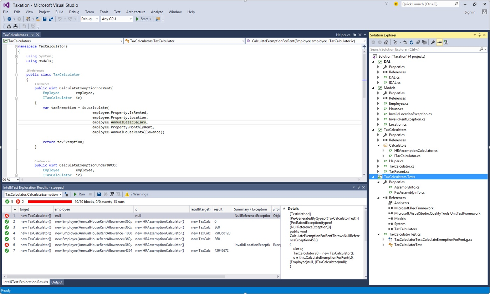

<properties
    pageTitle="IntelliTest for .NET"
    description="IntelliTest increases code path coverage with automatically-generated unit tests."
    slug="testing"
    order="400"    
    keywords="visual studio, vs2015, vs, visualstudio, productivity, ide, testing, IntelliTest, unit tests, unit testing"
/>

Visual Studio 2015 introduces IntelliTest (formerly known as "Smart Unit Tests"), which explores your .NET code to generate test data and a suite of unit tests. For every statement in the code, a test input is generated that will execute that statement. A case analysis is performed for every conditional branch in the code. For example, if statements, assertions, and all operations that can throw exceptions are analyzed. This analysis is used to generate test data for a parameterized unit test for each of your methods, creating unit tests with high code coverage. Then you bring your domain knowledge to improve these unit tests.

Functionality also includes:

- **Parameterized Unit Tests:** IntelliTest enables support for an API that you can use to guide test data generation, specify correctness properties of the code under test, and direct the exploration of the code under test. This API is available in the Microsoft.Pex.Framework namespace and can be used in the test methods (parameterized unit tests, factory methods) generated by IntelliTest. The "IntelliTest" context menu command is available from code under test and this parameterized unit test as well.
- **Test stubs creation:** "Create Unit Tests" is now available on the context menu as a command that provides the ability to create and configure a test project, a test class, and a test stub.

Documentation for this feature is found on [Generate unit tests for your code](https://msdn.microsoft.com/library/dn823749(v=vs.140).aspx).
