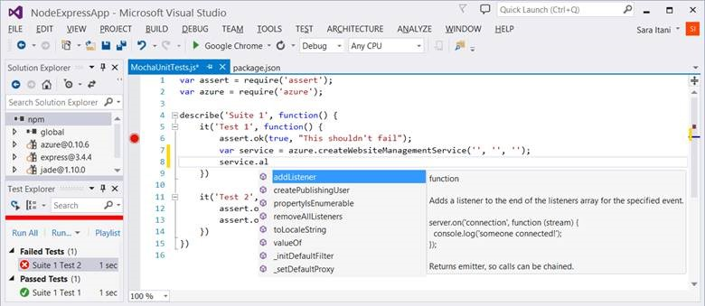
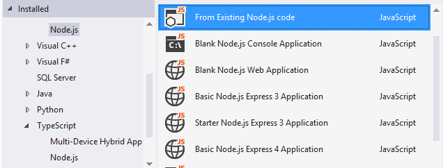
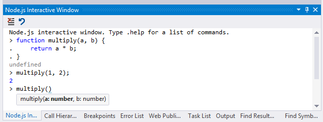
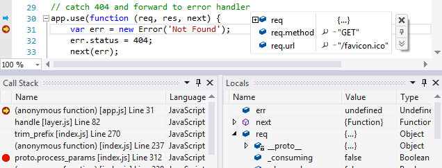
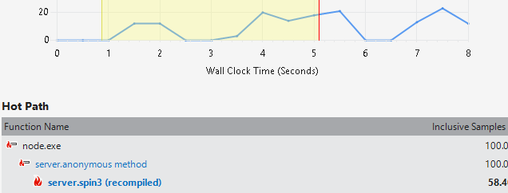
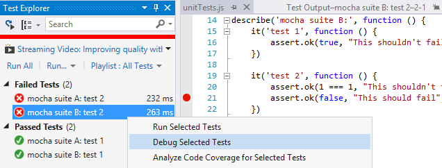

<properties
    pageTitle="Node.js Tools"
    description="Node.js is a platform for building fast, scalable applications using JavaScript, which you can run on various platforms including Linux, Mac OS X, and Windows. With Node.js Tools for Visual Studio, developers can take advantage of an official Microsoft open-source extension that enables first-class Visual Studio tooling support for Node.js projects."
    slug="nodejs"
    order="700"    
    keywords="visual studio, vs2015, vs, visualstudio, cross-platform, server, linux, windows, languages, node, node.js"
/>

[Node.js Tools for Visual Studio (NTVS)](http://aka.ms/ntvslatest) is a free, open-source extension that turns Visual Studio into a Node.js IDE. It enables you to unleash the full power of Visual Studio to develop and deploy Node.js solutions with our broad range of features: IntelliSense, advanced debugging and profiling, npm Integration, unit testing, interactive window, source control, cloud deployment, and more.

Node.js Tools 1.1 RC for Visual Studio adds support for Visual Studio 2015 and a new Linux-based Dockerfile template to make it easier to get your app up and running in a Docker container. It also makes enhancements to IntelliSense, formatting, debugging, TypeScript, unit test running/debugging, npm Integration, and more.

Additionally, it supports a new IoT extension that enables developers to deploy Node.js-based Universal Windows apps to Windows IoT Core devices like Raspberry Pi 2, and extends some of the IntelliSense and debugging functionality. Download the Node.js Tools for Visual Studio IoT extension from the [Windows Embedded Pre-Release Program](https://connect.microsoft.com/windowsembeddedIoT/Downloads/) (it is necessary to sign in and join that program to download the extension).

Check out the full [NTVS 1.1 RC release notes](http://aka.ms/ntvslatest) to learn more about the latest release and download the free tools.

## Key Features

### Project Templates

Get started building Node.js apps in Visual Studio using built-in project templates. Alternatively, use the command-line scaffolding tools you are already familiar with to generate your project, and import it into Visual Studio with just a few clicks.

### IntelliSense

Experience useful and syntactically-correct completions with the powerful IntelliSense engine that statically analyzes your Node.js code and any packages you are using.

### npm integration

Whether you prefer to interact with npm through a rich user interface, a command-line, or both… we've got you covered. Quickly search and install packages from a rich user interface, explore packages and their dependencies in the npm tree view, and see warnings when one of your dependencies is missing.

### Interactive Window

Enter Node.js code and see the results immediately in the Node.js Interactive Window (also known as a REPL window). You can use the same built-in modules, syntax, and variables you’d use in a Node.js script. And of course, you'll get full syntax highlighting and IntelliSense on your code, just like you do in the editor. 

### Advanced debugging, local and remote to any OS

Enjoy stepping through your code with breakpoints and automatic exception notifications in Visual Studio's interactive debugger. Advanced features include conditional breakpoints, tracepoints, hit counts, edit-and-continue, and cross-OS (Linux/MacOS/Windows) remote debugging.

### Profiling

Profiling reports provide views on the different levels of your application structure from source code lines to processes, and program execution data from the calling and called functions of a specific function to the call tree of the entire application. 

### Unit testing

Node.js Tools for Visual Studio includes support for discovering and executing unit tests. This allows you to author, run, debug, and filter unit tests without having to switch to a command prompt. Use mocha, or simply extend Visual Studio to work with your favorite unit testing framework. 

### TypeScript integration

TypeScript is a superset of JavaScript that compiles to clean JavaScript output. It adds optional types, classes, and modules, which enable you to write more maintainable code and take advantage of more powerful tooling. Node.js Tools for Visual Studio provides full end-to-end support (from IntelliSense to unit testing) for working with TypeScript in your Node.js apps.

### Source control: command-line not required

Manage your Git/TFS projects, pending changes, and branches with ease using the Team Explorer. Alternatively check out one of the many source control extensions available for Visual Studio.

### Cloud integration

Create, test, and deploy web applications written with Node.js, and debug them from your desk while they run on your Linux or Windows-based server. Additionally, take advantage of tight Visual Studio integration with cross-platform Azure services for Node.js – even if you are not deploying to Azure (e.g. monitor performance and usage of your live application with Application Insights.)

### Customize yout tools with extensions for Grunt, Gulp, and more

Complement your experience with the many JavaScript and Node.js extensions available in the Visual Studio Gallery. Popular extensions include: 

- [Package IntelliSense](https://visualstudiogallery.msdn.microsoft.com/65748cdb-4087-497e-a394-2e3449c8e61e) 
- [Web Essentials](http://vswebessentials.com/) (includes jslint and jshint support)
- [Task Runner Explorer](https://visualstudiogallery.msdn.microsoft.com/8e1b4368-4afb-467a-bc13-9650572db708) (for grunt and gulp)
- [EditorConfig](https://visualstudiogallery.msdn.microsoft.com/c8bccfe2-650c-4b42-bc5c-845e21f96328) 
