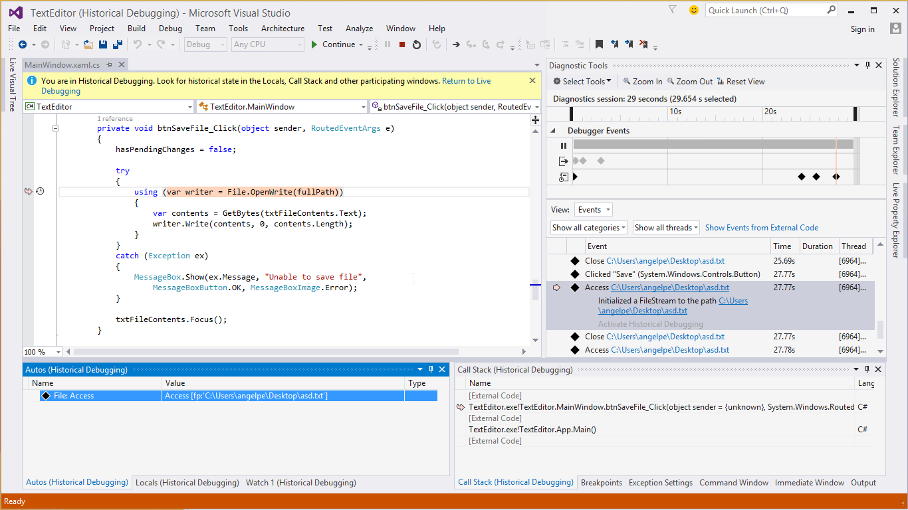

<properties
	pageTitle="Visual Studio 2015"
	description="Visual Studio 2015 delivers new capabilities to help developers achieve more and extends that productivity and power across multiple platforms—from Windows to Linux to iOS and Android—to meet the demands of today's diverse, mobile-first, cloud-first world."
	slug="vs2015"
    order="100"
	keywords="visual studio, visualstudio, ide"
/>

Product highlights include:

- **[Cross-platform mobile development](../crossplatmobile):** Build cross-platform mobile apps for Android, iOS, and Windows. Developers can use the Visual Studio Tools for Apache Cordova to build apps with HTML, CSS, and JavaScript, use Visual C++ cross-platform library development, or build native apps using C# with Xamarin. A free edition of Xamarin—the Xamarin Starter Edition—is included with Visual Studio 2015.
- **[Cross-platform server development](../xplatserver):** Developers can build cross-platform server applications and deploy them to Windows and Linux servers. With Visual Studio 2015, they can use the programming language of their choice and enjoy rich tooling support for ASP.NET 5, Python, Node.js, and the new open-source .NET Core 5 that supports Windows, Linux, and Mac OS X.
- **[Windows development]()../windows):** Build the next generation of Windows apps and games for the Universal Windows Platform that run across all Windows 10 devices, including phones, tablets, PCs, and Xbox, as well as IoT and HoloLens. New diagnostic tools, new features in Blend, and the .NET Framework 4.6 deliver extended capabilities to both Windows Store and WPF developers alike.
- **[Productivity enhancements](../productivity):** In addition to a variety of IDE improvements, Visual Studio 2015 introduces a much richer debugging experience, which now includes integrated, advanced capabilities such as performance monitoring and historical debugging in the same experience. Also, Microsoft has added many new features for managed-code developers through .NET Compiler Platform, such as Light Bulbs to help fix common code issues, improved refactoring tools, and live code analysis that automates code fixes while you're typing.
- **[Programming language support](../languages).** Visual Studio 2015 delivers updates to its most populate programming languages, including C#, Visual Basic, C++, and TypeScript, along with extensions for Python and Node.js.

The 2015 release is offered through the following editions:
- *Visual Studio Community 2015*: Free, full-featured and extensible tool for developers building non-enterprise applications.
- *Visual Studio Professional 2015 with MSDN*: Professional developer tools and services for individual developers or small teams.  
- *Visual Studio Enterprise with MSDN*: Enterprise grade solution with advanced capabilities for teams working on projects of any size or complexity, including advanced testing and DevOps. With Visual Studio Enterprise, customers get the advantage of the most powerful edition of the product, and at a lower price point than Visual Studio Ultimate 2013.

Details on the editions can be found on [Visual Studio 2015 Product Offerings](https://www.visualstudio.com/products/vs-2015-product-editions).
 
Get started today by downloading [_Visual Studio 2015_](https://www.visualstudio.com/en-us/downloads/).

