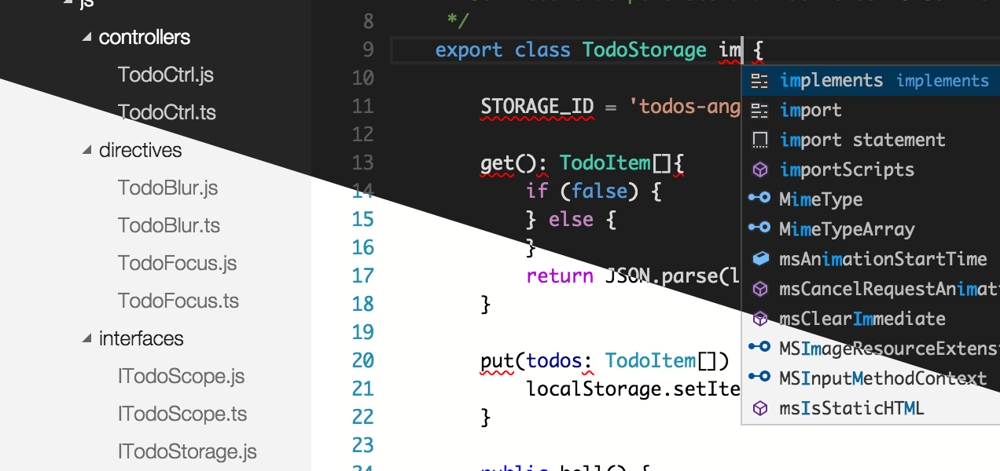
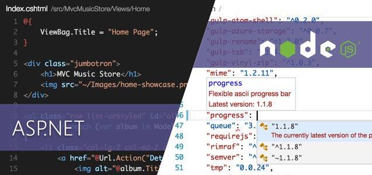

<properties
	pageTitle="Visual Studio Code"
	description="Visual Studio Code redefines code editing, providing a fast, streamlined coding experience with rich code assistance and navigation for multiple languages, and includes an enhanced set of features for developers who are building JavaScript, TypeScript, Node.js, and ASP.NET 5 applications."
	slug="vscode"
    order="300"
	keywords="visual studio, visual studio code, visualstudio"
/>

Visual Studio Code is a free cross-platform code editor for building modern Web and cloud applications (in preview as of the release of Visual Studio 2015). It extends the Visual Studio family by offering a lightweight code editor that runs natively on Windows, Linux, and Mac OS X. It provides intelligent code authoring and navigation in a lightweight, fast, keyboard-centric tool, along with integrated debugging and Git support.

Download today for [Windows](http://go.microsoft.com/fwlink/?LinkID=534107), [Linux x64](http://go.microsoft.com/fwlink/?LinkID=534108), [Linux x32](http://go.microsoft.com/fwlink/?LinkID=615206) and [Mac OS X](http://go.microsoft.com/fwlink/?LinkID=534106).

### Language Coverage

Visual Studio Code supports 30+ languages and counting, with syntax highlighting, bracket matching, and more. Languages include JavaScript, C#, C++, PHP, Java, HTML, R, CSS, SQL, Markdown, TypeScript, LESS, SASS, JSON, XML, and Python as well as many other common file formats.

For the full set of languages and additional details, see [Language Support in Visual Studio Code](https://code.visualstudio.com/docs/languages).

### Code-focused editing

A lightweight editor with first-class keyboard-centric gestures and multiple cursors means you never need to reach for the mouse. Instantly open large or small files and focus on your code without distraction. Leverage advanced editing features such as multiple cursors, auto-save, and more.

### Code navigation: RegEx find, outlining, peek definition

Keep in context as you move through large code files and across your code base. The enhanced scrollbar highlights issues in the current file, integrated find supports regular expressions. Code outlining, navigate to and peek definition help you get where you need to be fast.

### Code understanding: IntelliSense, linting, refactoring

IntelliSense describes APIs as you type, auto-completing to increase speed and accuracy. Quick Info tool tips let you inspect API definitions, and “Squiggles” let you know about issues, often showing them as you type.

### Debugging: Break, watch, inspect

Diagnose issues with your application with integrated debugging tools for Node.js, TypeScript, and JavaScript. Set breakpoints in your code, break on exceptions, watch variables, step through your code, or navigate up the call stack, as well as attaching to local running processes.

### Git version control: Commit, diff, pull and push

Embrace modern workflows with the power and flexibility of Git. See changed files, diffs, and make commits right from within the editor. Connect with the entire Git universe by pulling and pushing code to any remote—GitHub, Azure Web Apps, Visual Studio Online, and more. 

### Make it yours: Choose your theme, customizable key bindings, and more

It’s one thing to be able to work with any source file, any Git remote and on your favorite OS. Code allows you to configure the environment the way you want with support for multiple UI themes, custom key-bindings, and more.

### ASP.NET 5 and Node.js: Rich support for modern web technologies

Visual Studio Code supports the end-to-end development workflow for ASP.NET 5 and Node.js applications. Full IntelliSense, debugging support, and more across all supported operating systems. Including many of your favorite frameworks such as D3, JQuery, Express, Angular, grunt, gulp, and more.

 
*For complete details, refer to the [Visual Studio Code Documentation](https://code.visualstudio.com/Docs).*